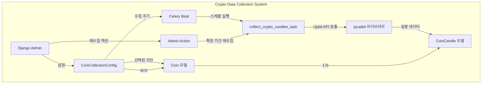

# 사용자의 최초 요청 (기록용)
비트코인 데이터를 추가하기 위한 모델 생성
pyupbit 라이브러리를 설치
admin에서 수집할 코인을 선택하는 메뉴 추가
 - 수집할 시세캔들 전체 또는 선택 가능
 - 수집 주기 선택
 - 한번에 추가할 수집 기간 설정 가능
 - 재수집 기능 추가
amdin에서 설정한 코인에 대한 데이터를 일 단위로 저장
작업이 완료되면 docs 폴더에 작업 내용을 문서로 남겨줘
-review

## 사용자가 이후에 추가 요청한 내용들 (기록용)
(없음)

# 작업 목표
- **암호화폐(비트코인 등) 데이터 수집 기능 추가**
- **Upbit API 연동을 위한 pyupbit 라이브러리 설치**
- **Django Admin에서 수집 대상 코인 및 설정 관리**
- **일 단위 캔들 데이터 자동 수집 및 저장**
- **재수집 기능 제공**
- **작업 내용 문서화**

# 작업 계획 상세 수준
detail_level = detailed

# 작업 배경
현재 kstock_reporter 프로젝트는 한국 주식(KRX) 데이터만 수집하고 있습니다. 사용자는 암호화폐 데이터도 수집하여 주식과 함께 분석하고 싶어합니다. 기존 stocks 앱의 패턴(모델, 서비스, 태스크, Admin)을 참고하여 새로운 crypto 앱을 추가합니다.

Upbit은 한국 최대 암호화폐 거래소이며, python-upbit-api는 공식 API를 래핑한 라이브러리입니다. 이를 사용하여 일 단위 캔들 데이터를 수집하고, Django Admin에서 수집 대상 코인과 주기를 설정할 수 있도록 합니다.

# 작업 시작 여부
is_execution_started = TRUE

# 모든 목표 달성 여부
is_all_goals_accomplished = FALSE

# 병렬 실행 여부
parallel_requested = FALSE

# 현재 진행 중인 작업
- TODO #0: Git 브랜치 생성 및 작업 환경 준비 진행 중

# 필요한 사전 지식

## 기술 스택
- **Python**: 3.13.8
- **Django**: 5.1.1
- **Celery**: 5.5.3 (with Beat for scheduling)
- **Redis**: DB0-DB3 (Broker, Results, Cache, Rate Limiting)
- **Upbit API**: python-upbit-api 라이브러리
- **Testing**: pytest, pytest-django, pytest-asyncio

## 프로젝트 구조
```
kstock_reporter/
├── config/          # Django 설정
├── apps/
│   ├── accounts/    # 사용자, 관심목록
│   ├── stocks/      # 주식 종목, 가격 데이터 (참고 패턴)
│   ├── crypto/      # (신규) 암호화폐 데이터 <-- 이번 작업
│   ├── reports/     # 일일 리포트 생성
│   ├── notifications/  # 카카오 알림톡
│   └── common/      # 공통 유틸리티
├── api/             # FastAPI 라우터
└── main.py          # FastAPI 애플리케이션
```

## Upbit API 개념
- **마켓 코드**: KRW-BTC, KRW-ETH 등 (거래 쌍)
- **캔들 타입**: minutes(분봉), days(일봉), weeks(주봉), months(월봉)
- **일봉 API**: `pyupbit.get_ohlcv()` - Open, High, Low, Close, Volume 데이터 반환
- **Rate Limit**: 초당 10회, 분당 600회 제한 (주의: 루프에서 API 호출 시 time.sleep() 필요)
- **데이터 제한**: get_ohlcv()는 최대 200개 캔들까지만 한번에 조회 가능

## 파일 구조 및 역할

### 신규 생성 파일
1. **apps/crypto/__init__.py** - 앱 초기화
2. **apps/crypto/apps.py** - 앱 설정
3. **apps/crypto/models.py** - Coin, CoinCandle, CoinCollectionConfig 모델
4. **apps/crypto/admin.py** - Django Admin 설정 (수집 설정, 재수집 액션)
5. **apps/crypto/services.py** - Upbit API 호출 로직
6. **apps/crypto/tasks.py** - Celery 태스크 (자동 수집)
7. **apps/crypto/tests/test_models.py** - 모델 테스트
8. **apps/crypto/tests/test_services.py** - 서비스 테스트
9. **apps/crypto/tests/test_tasks.py** - 태스크 테스트
10. **apps/crypto/migrations/0001_initial.py** - 초기 마이그레이션
11. **apps/common/managers.py** (수정) - CoinQuerySet, CoinCandleQuerySet 추가
12. **apps/common/exceptions.py** (수정) - CryptoDataFetchError 추가
13. **config/settings/base.py** (수정) - INSTALLED_APPS, Celery Beat 스케줄 추가
14. **requirements.txt** (수정) - pyupbit 추가
15. **docs/crypto_implementation.txt** - 작업 내용 문서화

## 맥락 이해를 위해 참고해야 할 파일들

### 1. apps/stocks/models.py
- **역할**: 주식 종목과 일별 가격 모델 정의 (참고 패턴)
- **참고할 부분**: Stock, DailyPrice 모델 구조
- **예상 코드 구조**:
   ```python
   class Stock(models.Model):
       code = models.CharField("종목코드", max_length=10, unique=True)
       name = models.CharField("종목명", max_length=100)
       market = models.CharField("시장", max_length=20, blank=True, null=True)
       is_active = models.BooleanField("사용 여부", default=True)
       objects = StockQuerySet.as_manager()

   class DailyPrice(models.Model):
       stock = models.ForeignKey(Stock, on_delete=models.CASCADE, related_name="prices")
       trade_date = models.DateField("거래일", db_index=True)
       open_price = models.DecimalField(max_digits=15, decimal_places=2)
       high_price = models.DecimalField(max_digits=15, decimal_places=2)
       low_price = models.DecimalField(max_digits=15, decimal_places=2)
       close_price = models.DecimalField(max_digits=15, decimal_places=2)
       volume = models.BigIntegerField("거래량")
       objects = DailyPriceQuerySet.as_manager()
   ```

### 2. apps/stocks/admin.py
- **역할**: Django Admin에서 주식 데이터 관리
- **참고할 부분**: StockAdmin, DailyPriceAdmin의 list_display, fieldsets 패턴
- **주의사항**: search_fields, list_filter, autocomplete_fields 활용

### 3. apps/stocks/services.py
- **역할**: pykrx를 사용한 데이터 수집 로직
- **참고할 부분**: @log_execution_time, @retry_on_failure 데코레이터 사용
- **예상 코드 구조**:
   ```python
   @log_execution_time
   @retry_on_failure(max_retries=3, delay=2.0)
   def sync_stock_master_from_krx(target_date: date | None = None) -> int:
       from pykrx import stock as krx
       # API 호출 및 DB 저장
       Stock.objects.update_or_create(...)
       return updated_count
   ```

### 4. apps/stocks/tasks.py
- **역할**: Celery 태스크로 주기적 데이터 수집
- **참고할 부분**: @shared_task(bind=True, max_retries=3) 패턴
- **예상 코드 구조**:
   ```python
   @shared_task(bind=True, max_retries=3, default_retry_delay=60)
   def sync_stock_master_task(self, target_date_str: str | None = None):
       try:
           logger.info(f"[Task] Starting stock master sync")
           count = sync_stock_master_from_krx(target_date)
           return {"success": True, "count": count}
       except StockDataFetchError as exc:
           logger.error(f"[Task] Sync failed: {exc}")
           raise self.retry(exc=exc, countdown=60)
   ```

### 5. apps/common/exceptions.py
- **역할**: 프로젝트 전체 커스텀 예외 정의
- **참고할 부분**: KStockBaseException, StockDataFetchError 패턴
- **주의사항**: CryptoDataFetchError를 동일한 패턴으로 추가

### 6. config/settings/base.py
- **역할**: Django 설정 (INSTALLED_APPS, Celery Beat 스케줄)
- **참고할 부분**: CELERY_BEAT_SCHEDULE 딕셔너리
- **주의사항**: 기존 스케줄 (07:00, 07:20, 07:30, 08:00) 유지하면서 추가

# 작업 계획

## PRDs & Structures



```mermaid
erDiagram
    CoinCollectionConfig ||--o{ CoinCollectionConfig_coins : "M2M"
    CoinCollectionConfig_coins }o--|| Coin : "relates to"
    Coin ||--o{ CoinCandle : "has many"

    CoinCollectionConfig {
        int id PK
        string name
        string candle_type
        string collection_interval
        int period_days
        boolean is_active
        datetime created_at
        datetime updated_at
    }

    Coin {
        int id PK
        string market_code UK
        string korean_name
        string english_name
        boolean is_active
        datetime created_at
    }

    CoinCandle {
        int id PK
        int coin_id FK
        date trade_date UK_with_coin
        decimal open_price
        decimal high_price
        decimal low_price
        decimal close_price
        bigint volume
        decimal candle_acc_trade_volume
        datetime created_at
    }
```

## 구현 세부사항

### 1. 모델 설계 (apps/crypto/models.py)
- **Coin 모델**: 코인 정보 (market_code, korean_name, english_name)
- **CoinCandle 모델**: 일봉 데이터 (coin, trade_date, OHLCV)
- **CoinCollectionConfig 모델**: 수집 설정
  - coins: M2M to Coin (수집 대상 코인 선택)
  - candle_type: 캔들 타입 (기본: days)
  - collection_interval: 수집 주기 (매일, 매주, 매월)
  - period_days: 한번에 수집할 기간 (1~200일)
  - is_active: 활성화 여부

### 2. Admin 설정 (apps/crypto/admin.py)
- **CoinAdmin**: 코인 목록 관리
  - list_display: market_code, korean_name, english_name, is_active
  - search_fields: market_code, korean_name, english_name
- **CoinCollectionConfigAdmin**: 수집 설정 관리
  - filter_horizontal: coins (M2M 선택 UI)
  - actions: [recollect_candles] (재수집 액션)
  - 재수집: start_date, end_date 입력받아 해당 기간 재수집
- **CoinCandleAdmin**: 수집된 데이터 조회
  - list_display: coin, trade_date, close_price, volume
  - date_hierarchy: trade_date
  - autocomplete_fields: [coin]

### 3. 서비스 계층 (apps/crypto/services.py)
- **fetch_all_coins()**: Upbit의 모든 KRW 마켓 코인 목록 조회 및 DB 저장
- **fetch_coin_candles(coin, start_date, end_date, candle_type)**: 특정 코인의 캔들 데이터 수집
- **bulk_collect_candles(config)**: CoinCollectionConfig 기반 일괄 수집
- 에러 처리: CryptoDataFetchError, rate limiting 대응

### 4. Celery 태스크 (apps/crypto/tasks.py)
- **sync_coin_master_task()**: 코인 목록 동기화
- **collect_crypto_candles_task(config_id)**: 설정별 자동 수집
- Celery Beat 스케줄: 매일 07:10 실행 (stocks 수집과 겹치지 않도록)

### 5. 테스트 작성

**테스트 유형 구분**:
- **Unit Tests (단위 테스트)**: 외부 의존성(API, 데이터베이스 등)을 Mock으로 대체하여 빠르게 실행
  - `test_models.py`: 모델 생성, QuerySet, 제약 조건 테스트 (DB 사용, 하지만 단위 테스트로 분류)
  - `test_services.py`: **pyupbit API를 @patch로 모킹**하여 서비스 로직 테스트 (실제 API 호출 없음)
  - `test_tasks.py`: **Celery 태스크를 모킹**하여 성공/실패/재시도 로직 테스트 (실제 태스크 실행 없음)

- **Integration Tests (통합 테스트)**: 실제 외부 시스템(API, Celery, Redis)과 통합하여 테스트
  - Django shell에서 `fetch_all_coins()` 실행 → **실제 Upbit API 호출** (TODO 7.2)
  - Celery worker에서 태스크 실행 → **실제 Celery/Redis 사용** (TODO 7.4)
  - Admin 사이트에서 재수집 액션 → **실제 전체 플로우 테스트** (TODO 7.3)

**주의사항**:
- pytest 실행 시에는 **모든 테스트가 Unit Tests (모킹 사용)**이므로 실제 API 호출 없음
- 실제 API 테스트는 Django shell 또는 Admin 사이트에서 수동으로 진행
- CI/CD 파이프라인에서는 Unit Tests만 실행 (빠르고 외부 의존성 없음)

## 프로젝트 커밋 메시지 스타일
```bash
# 최근 커밋 분석 결과:
66e37b2 Apply caching to reports service for performance optimization
9ff5b7e chore: Update requirements.txt with all dependencies
8194c43 fix: Fix failing tests in reports and stocks modules
6f1a06d feat: Add API pagination schema and apply to stocks endpoint
b3fff01 feat: Connect custom managers to models
```

**커밋 메시지 패턴**:
- 타입 접두사: feat, fix, chore, docs, test 등
- 첫 글자 대문자로 시작
- 명령문 형태 (예: "Add", "Fix", "Update")
- 간결하고 명확하게 (1줄 요약)
- 필요시 본문에 상세 설명

# TODOs

- [ ] 0. Git 브랜치 생성 및 작업 환경 준비
   - [ ] 0.1 작업용 브랜치 생성
      ```bash
      git checkout -b feature/crypto-data-collection
      ```
      - 현재: main 브랜치에서 작업 중
      - 변경: feature 브랜치에서 작업하여 main 브랜치 보호
   - [ ] 아래의 가이드대로 진행했을 때 0번 작업 검증 성공 여부
      - [ ] `git branch` 실행 시 feature/crypto-data-collection 브랜치가 표시되는가?
      - [ ] `git branch --show-current` 실행 시 feature/crypto-data-collection이 출력되는가?

- [ ] 1. 환경 준비 및 pyupbit 라이브러리 설치
   - [ ] 1.1 Redis 연결 확인
      ```bash
      if ! redis-cli ping > /dev/null 2>&1; then
          echo "ERROR: Redis is not running"
          exit 1
      fi
      echo "OK: Redis is running"
      ```
      - 현재: Redis 연결 상태 미확인
      - 변경: Redis가 정상 작동 중인지 확인 (Celery broker로 사용), 실패 시 exit
   - [ ] 1.2 apps/common/utils.py 확인 및 데코레이터 존재 여부 검증
      ```bash
      # 파일 존재 확인
      if [ ! -f apps/common/utils.py ]; then
          echo "ERROR: apps/common/utils.py not found"
          exit 1
      fi

      # 둘 다 존재하는지 확인
      if ! grep -q "def log_execution_time" apps/common/utils.py || ! grep -q "def retry_on_failure" apps/common/utils.py; then
          echo "ERROR: Missing required decorators - check apps/stocks/services.py for reference implementation"
          exit 1
      fi
      echo "OK: Both decorators exist"
      ```
      - 현재: 데코레이터 존재 여부 미확인
      - 변경: 파일 존재 및 필수 데코레이터 존재 확인, 없으면 에러로 exit
      - 참고: apps/stocks/services.py에서 동일한 데코레이터를 사용하므로 구현되어 있어야 함
   - [ ] 1.3 설치: pyupbit 라이브러리 추가 (버전 고정)
      ```bash
      pip install pyupbit==0.2.31
      ```
      - 현재: requirements.txt에 pyupbit 없음
      - 변경: pyupbit 0.2.31 버전 설치 (안정적인 최신 버전)
      - 주의: pandas 라이브러리가 pyupbit의 의존성으로 자동 설치됨 (이미 requirements.txt에 존재)
   - [ ] 1.4 확인: pyupbit 임포트 테스트
      ```bash
      if ! python -c "import pyupbit; print(pyupbit.__version__)" > /dev/null 2>&1; then
          echo "ERROR: pyupbit import failed"
          exit 1
      fi
      python -c "import pyupbit; print('OK: pyupbit version:', pyupbit.__version__)"
      ```
   - [ ] 1.5 requirements.txt 업데이트
      ```bash
      pip freeze | grep pyupbit >> requirements.txt
      ```
   - [ ] 1.6 커밋
      ```bash
      git add requirements.txt
      git commit -m "chore: Add pyupbit library for cryptocurrency data collection"
      ```
   - [ ] 아래의 가이드대로 진행했을 때 1번 작업 검증 성공 여부
      - [ ] Redis가 정상 작동하는가? (`redis-cli ping` 실행 시 PONG 응답)
      - [ ] apps/common/utils.py에 log_execution_time, retry_on_failure 데코레이터가 존재하는가?
      - [ ] pyupbit 0.2.31이 설치되었는가? (`pip show pyupbit | grep Version`)
      - [ ] requirements.txt에 pyupbit==0.2.31이 추가되었는가?
      - [ ] `python -c "import pyupbit"` 실행 시 에러가 없는가?
      - [ ] git log에 커밋이 추가되었는가?

- [ ] 2. crypto 앱 생성 및 기본 구조 설정
   - [ ] 2.1 구현: Django 앱 생성
      ```bash
      cd /Users/indent/Desktop/Noah/repo/kstock_reporter/apps
      if ! django-admin startapp crypto; then
          echo "ERROR: Failed to create crypto app"
          exit 1
      fi
      cd ..

      # 앱 생성 확인
      if [ ! -d apps/crypto ]; then
          echo "ERROR: apps/crypto directory was not created"
          exit 1
      fi
      echo "OK: crypto app created successfully"
      ```
      - 현재: apps/crypto 디렉토리 없음
      - 변경: apps/crypto/ 디렉토리 생성, 실패 시 exit
   - [ ] 2.2 구현: apps/crypto/__init__.py 확인 (빈 파일로 유지)
      - 현재: 기본 생성된 빈 __init__.py
      - 변경: 수정 불필요 (빈 파일 유지)
      - 주의: Django 3.2+ 에서는 default_app_config가 deprecated되어 사용하지 않음
   - [ ] 2.3 구현: apps/crypto/apps.py 수정
      ```python
      from django.apps import AppConfig

      class CryptoConfig(AppConfig):
          default_auto_field = 'django.db.models.BigAutoField'
          name = 'apps.crypto'
          verbose_name = '암호화폐'
      ```
      - 현재: 기본 생성된 앱 설정
      - 변경: name을 'apps.crypto'로 수정, verbose_name 추가
   - [ ] 2.4 구현: config/settings/base.py의 INSTALLED_APPS에 추가
      ```python
      INSTALLED_APPS = [
          # ... 기존 앱들 ...
          'apps.accounts',
          'apps.stocks',
          'apps.crypto',  # 추가
          'apps.reports',
          'apps.notifications',
      ]
      ```
      - 현재: apps.crypto 없음
      - 변경: INSTALLED_APPS에 'apps.crypto' 추가
   - [ ] 2.5 구현: apps/crypto/tests/__init__.py 생성 (빈 파일)
   - [ ] 2.6 커밋
      ```bash
      git add apps/crypto/ config/settings/base.py
      git commit -m "feat: Create crypto app for cryptocurrency data collection"
      ```
   - [ ] 아래의 가이드대로 진행했을 때 2번 작업 검증 성공 여부
      - [ ] apps/crypto 디렉토리가 생성되었는가?
      - [ ] apps/crypto/apps.py의 name이 'apps.crypto'인가?
      - [ ] config/settings/base.py의 INSTALLED_APPS에 'apps.crypto'가 추가되었는가?
      - [ ] `python manage.py check` 실행 시 에러가 없는가?
      - [ ] git log에 커밋이 추가되었는가?

- [ ] 3. 암호화폐 모델 생성 및 마이그레이션
   - [ ] 3.1 구현: apps/common/managers.py에 CoinQuerySet, CoinCandleQuerySet 추가 (models.py보다 먼저!)
      ```python
      # 기존 StockQuerySet, DailyPriceQuerySet 다음에 추가

      class CoinQuerySet(models.QuerySet):
          """Coin 모델용 커스텀 QuerySet"""

          def active(self):
              """활성화된 코인만 조회"""
              return self.filter(is_active=True)

          def by_market_code(self, market_code: str):
              """마켓 코드로 조회"""
              return self.filter(market_code=market_code)

          def search(self, keyword: str):
              """코인 검색 (마켓 코드, 한글명, 영문명)"""
              return self.filter(
                  models.Q(market_code__icontains=keyword) |
                  models.Q(korean_name__icontains=keyword) |
                  models.Q(english_name__icontains=keyword)
              )


      class CoinCandleQuerySet(models.QuerySet):
          """CoinCandle 모델용 커스텀 QuerySet"""

          def for_coin(self, coin):
              """특정 코인의 캔들 데이터"""
              return self.filter(coin=coin)

          def for_date_range(self, start_date, end_date):
              """특정 기간의 캔들 데이터"""
              return self.filter(trade_date__range=[start_date, end_date])

          def latest_candles(self, limit=10):
              """최신 캔들 데이터"""
              return self.order_by('-trade_date')[:limit]
      ```
      - 현재: StockQuerySet, DailyPriceQuerySet만 존재
      - 변경: CoinQuerySet, CoinCandleQuerySet 추가
      - 주의: 이 단계를 models.py보다 먼저 실행해야 import error 방지
   - [ ] 3.2 구현: apps/crypto/models.py 작성
      ```python
      from django.db import models
      from django.core.validators import MinValueValidator, MaxValueValidator
      from apps.common.managers import CoinQuerySet, CoinCandleQuerySet


      class Coin(models.Model):
          """암호화폐 코인 정보"""
          market_code = models.CharField("마켓 코드", max_length=20, unique=True, help_text="예: KRW-BTC")
          korean_name = models.CharField("한글명", max_length=100)
          english_name = models.CharField("영문명", max_length=100)
          is_active = models.BooleanField("사용 여부", default=True)
          created_at = models.DateTimeField("생성일시", auto_now_add=True)
          updated_at = models.DateTimeField("수정일시", auto_now=True)

          objects = CoinQuerySet.as_manager()

          class Meta:
              db_table = 'crypto_coin'
              verbose_name = '암호화폐 코인'
              verbose_name_plural = '암호화폐 코인 목록'
              ordering = ['market_code']

          def __str__(self):
              return f"{self.market_code} ({self.korean_name})"


      class CoinCandle(models.Model):
          """암호화폐 일봉 캔들 데이터"""
          coin = models.ForeignKey(Coin, on_delete=models.CASCADE, related_name='candles', verbose_name="코인")
          trade_date = models.DateField("거래일", db_index=True)

          open_price = models.DecimalField("시가", max_digits=20, decimal_places=8)
          high_price = models.DecimalField("고가", max_digits=20, decimal_places=8)
          low_price = models.DecimalField("저가", max_digits=20, decimal_places=8)
          close_price = models.DecimalField("종가", max_digits=20, decimal_places=8)

          volume = models.DecimalField("거래량(코인)", max_digits=20, decimal_places=8)
          candle_acc_trade_volume = models.DecimalField("누적 거래대금(KRW)", max_digits=20, decimal_places=2, null=True, blank=True)

          created_at = models.DateTimeField("생성일시", auto_now_add=True)
          updated_at = models.DateTimeField("수정일시", auto_now=True)

          objects = CoinCandleQuerySet.as_manager()

          class Meta:
              db_table = 'crypto_coin_candle'
              verbose_name = '암호화폐 캔들'
              verbose_name_plural = '암호화폐 캔들 데이터'
              unique_together = ('coin', 'trade_date')
              ordering = ['-trade_date']
              indexes = [
                  models.Index(fields=['coin', '-trade_date']),
              ]

          def __str__(self):
              return f"{self.coin.market_code} - {self.trade_date}"


      class CoinCollectionConfig(models.Model):
          """암호화폐 데이터 수집 설정"""
          CANDLE_TYPE_CHOICES = [
              ('days', '일봉'),
              ('minutes', '분봉'),
              ('weeks', '주봉'),
              ('months', '월봉'),
          ]

          INTERVAL_CHOICES = [
              ('daily', '매일'),
              ('weekly', '매주'),
              ('monthly', '매월'),
          ]

          name = models.CharField("설정명", max_length=100, unique=True)
          coins = models.ManyToManyField(Coin, related_name='collection_configs', verbose_name="수집 대상 코인")

          candle_type = models.CharField("캔들 타입", max_length=20, choices=CANDLE_TYPE_CHOICES, default='days')
          collection_interval = models.CharField("수집 주기", max_length=20, choices=INTERVAL_CHOICES, default='daily')
          period_days = models.IntegerField(
              "수집 기간(일)",
              default=30,
              help_text="한번에 수집할 일 수 (1~200)",
              validators=[MinValueValidator(1), MaxValueValidator(200)]
          )

          is_active = models.BooleanField("활성화", default=True)
          created_at = models.DateTimeField("생성일시", auto_now_add=True)
          updated_at = models.DateTimeField("수정일시", auto_now=True)

          class Meta:
              db_table = 'crypto_collection_config'
              verbose_name = '수집 설정'
              verbose_name_plural = '수집 설정 목록'
              ordering = ['-created_at']

          def __str__(self):
              return f"{self.name} ({'활성' if self.is_active else '비활성'})"
      ```
      - 현재: apps/crypto/models.py에 기본 내용만 있음
      - 변경: Coin, CoinCandle, CoinCollectionConfig 모델 추가
      - 주의: 3.1에서 이미 managers를 추가했으므로 import 가능
   - [ ] 3.3 마이그레이션 생성 및 적용
      ```bash
      # 마이그레이션 생성
      if ! python manage.py makemigrations crypto; then
          echo "ERROR: Failed to create migrations"
          exit 1
      fi

      # 마이그레이션 적용
      if ! python manage.py migrate crypto; then
          echo "ERROR: Failed to apply migrations"
          exit 1
      fi

      # 데이터베이스 테이블 생성 검증
      python manage.py dbshell <<EOF
.tables
.quit
EOF

      # 테이블 존재 확인 (SQLite 기준)
      if ! python -c "
from django.db import connection
cursor = connection.cursor()
cursor.execute(\"SELECT name FROM sqlite_master WHERE type='table' AND name LIKE 'crypto_%'\")
tables = cursor.fetchall()
expected_tables = {'crypto_coin', 'crypto_coin_candle', 'crypto_coin_collection_config', 'crypto_coin_collection_config_coins'}
found_tables = {t[0] for t in tables}
if not expected_tables.issubset(found_tables):
    print(f'ERROR: Missing tables. Expected {expected_tables}, found {found_tables}')
    exit(1)
print(f'OK: All tables created: {found_tables}')
"; then
          echo "ERROR: Table verification failed"
          exit 1
      fi
      ```
      - 현재: 마이그레이션 미적용
      - 변경: 마이그레이션 생성 및 적용 후 테이블 생성 검증
   - [ ] 3.4 테스트 작성: apps/crypto/tests/test_models.py
      ```python
      import pytest
      from datetime import date
      from decimal import Decimal

      from apps.crypto.models import Coin, CoinCandle, CoinCollectionConfig


      @pytest.mark.django_db
      class TestCoin:
          def test_create_coin(self):
              coin = Coin.objects.create(
                  market_code="KRW-BTC",
                  korean_name="비트코인",
                  english_name="Bitcoin"
              )
              assert coin.market_code == "KRW-BTC"
              assert coin.is_active is True
              assert str(coin) == "KRW-BTC (비트코인)"

          def test_coin_queryset_active(self):
              Coin.objects.create(market_code="KRW-BTC", korean_name="비트코인", english_name="Bitcoin", is_active=True)
              Coin.objects.create(market_code="KRW-ETH", korean_name="이더리움", english_name="Ethereum", is_active=False)

              active_coins = Coin.objects.active()
              assert active_coins.count() == 1
              assert active_coins.first().market_code == "KRW-BTC"


      @pytest.mark.django_db
      class TestCoinCandle:
          def test_create_candle(self, coin):
              candle = CoinCandle.objects.create(
                  coin=coin,
                  trade_date=date.today(),
                  open_price=Decimal("50000000"),
                  high_price=Decimal("51000000"),
                  low_price=Decimal("49000000"),
                  close_price=Decimal("50500000"),
                  volume=Decimal("100.5"),
                  candle_acc_trade_volume=Decimal("5000000000")
              )
              assert candle.coin == coin
              assert candle.close_price == Decimal("50500000")

          def test_unique_together_constraint(self, coin):
              CoinCandle.objects.create(
                  coin=coin,
                  trade_date=date.today(),
                  open_price=Decimal("50000000"),
                  high_price=Decimal("51000000"),
                  low_price=Decimal("49000000"),
                  close_price=Decimal("50500000"),
                  volume=Decimal("100.5")
              )

              with pytest.raises(Exception):  # IntegrityError
                  CoinCandle.objects.create(
                      coin=coin,
                      trade_date=date.today(),
                      open_price=Decimal("50000000"),
                      high_price=Decimal("51000000"),
                      low_price=Decimal("49000000"),
                      close_price=Decimal("50500000"),
                      volume=Decimal("100.5")
                  )


      @pytest.mark.django_db
      class TestCoinCollectionConfig:
          def test_create_config(self, coin):
              config = CoinCollectionConfig.objects.create(
                  name="비트코인 일봉 수집",
                  candle_type="days",
                  collection_interval="daily",
                  period_days=30
              )
              config.coins.add(coin)

              assert config.name == "비트코인 일봉 수집"
              assert config.is_active is True
              assert config.coins.count() == 1
      ```
      - 현재: 테스트 없음
      - 변경: 모델 생성, QuerySet, unique_together 제약 테스트 추가
      - **테스트 유형**: Unit Test (DB fixture 사용, 외부 API 호출 없음)
   - [ ] 3.5 conftest.py 확인 및 coin fixture 추가
      ```bash
      # conftest.py 존재 확인 및 생성
      CONFTEST_PATH=/Users/indent/Desktop/Noah/repo/kstock_reporter/conftest.py
      if [ ! -f "$CONFTEST_PATH" ]; then
          echo "Creating conftest.py..."
          cat > "$CONFTEST_PATH" <<'CONFTEST_EOF'
import pytest

CONFTEST_EOF
          echo "OK: conftest.py created"
      else
          echo "OK: conftest.py already exists"
      fi

      # coin fixture 중복 확인 후 추가 (기존 내용 보존)
      if ! grep -q "def coin(db):" "$CONFTEST_PATH"; then
          cat >> "$CONFTEST_PATH" <<'FIXTURE_EOF'

@pytest.fixture
def coin(db):
    from apps.crypto.models import Coin
    return Coin.objects.create(
        market_code="KRW-BTC",
        korean_name="비트코인",
        english_name="Bitcoin",
        is_active=True
    )
FIXTURE_EOF
          echo "OK: coin fixture added"
      else
          echo "OK: coin fixture already exists"
      fi
      ```
      - 파일 위치: /Users/indent/Desktop/Noah/repo/kstock_reporter/conftest.py (프로젝트 루트)
      - 주의: 기존 conftest.py가 있으면 내용을 보존하고 append, 없으면 새로 생성
   - [ ] 3.6 테스트 실행
      ```bash
      pytest apps/crypto/tests/test_models.py -v
      ```
   - [ ] 3.7 커밋
      ```bash
      git add apps/crypto/models.py apps/common/managers.py apps/crypto/migrations/ apps/crypto/tests/ conftest.py
      git commit -m "feat: Add cryptocurrency models (Coin, CoinCandle, CoinCollectionConfig)"
      ```
   - [ ] 아래의 가이드대로 진행했을 때 3번 작업 검증 성공 여부
      - [ ] apps/crypto/models.py에 Coin, CoinCandle, CoinCollectionConfig 모델이 있는가?
      - [ ] apps/common/managers.py에 CoinQuerySet, CoinCandleQuerySet가 추가되었는가?
      - [ ] python manage.py makemigrations 실행 시 마이그레이션 파일이 생성되었는가?
      - [ ] python manage.py migrate 실행 시 에러 없이 완료되었는가?
      - [ ] pytest apps/crypto/tests/test_models.py 실행 시 모든 테스트가 통과하는가?
      - [ ] Django shell에서 `from apps.crypto.models import Coin; Coin.objects.create(market_code="KRW-BTC", korean_name="비트코인", english_name="Bitcoin")` 실행 시 정상 생성되는가?
      - [ ] git log에 커밋이 추가되었는가?

- [ ] 4. Django Admin 설정 (코인 관리 및 수집 설정)
   - [ ] 4.1 구현: apps/crypto/admin.py 작성
      ```python
      from django.contrib import admin
      from django.utils.html import format_html
      from django.shortcuts import render
      from django import forms
      from datetime import date, timedelta

      from .models import Coin, CoinCandle, CoinCollectionConfig


      @admin.register(Coin)
      class CoinAdmin(admin.ModelAdmin):
          list_display = ('market_code', 'korean_name', 'english_name', 'is_active', 'created_at')
          list_filter = ('is_active', 'created_at')
          search_fields = ('market_code', 'korean_name', 'english_name')
          list_editable = ('is_active',)
          ordering = ('market_code',)

          fieldsets = (
              ('기본 정보', {
                  'fields': ('market_code', 'korean_name', 'english_name')
              }),
              ('설정', {
                  'fields': ('is_active',)
              }),
              ('타임스탬프', {
                  'fields': ('created_at', 'updated_at'),
                  'classes': ('collapse',)
              }),
          )

          readonly_fields = ('created_at', 'updated_at')


      class RecollectCandlesForm(forms.Form):
          """재수집 액션을 위한 폼"""
          start_date = forms.DateField(
              label="시작일",
              initial=lambda: date.today() - timedelta(days=30),
              widget=forms.DateInput(attrs={'type': 'date'})
          )
          end_date = forms.DateField(
              label="종료일",
              initial=date.today,
              widget=forms.DateInput(attrs={'type': 'date'})
          )


      @admin.register(CoinCollectionConfig)
      class CoinCollectionConfigAdmin(admin.ModelAdmin):
          list_display = ('name', 'candle_type', 'collection_interval', 'period_days', 'coin_count', 'is_active')
          list_filter = ('candle_type', 'collection_interval', 'is_active')
          search_fields = ('name',)
          filter_horizontal = ('coins',)

          fieldsets = (
              ('기본 정보', {
                  'fields': ('name', 'coins')
              }),
              ('수집 설정', {
                  'fields': ('candle_type', 'collection_interval', 'period_days')
              }),
              ('활성화', {
                  'fields': ('is_active',)
              }),
          )

          actions = ['recollect_candles']

          def coin_count(self, obj):
              """선택된 코인 수"""
              return obj.coins.count()
          coin_count.short_description = '코인 수'

          def recollect_candles(self, request, queryset):
              """선택된 설정의 코인들에 대해 재수집"""
              if 'apply' in request.POST:
                  form = RecollectCandlesForm(request.POST)
                  if form.is_valid():
                      start_date = form.cleaned_data['start_date']
                      end_date = form.cleaned_data['end_date']

                      from apps.crypto.tasks import recollect_candles_task

                      for config in queryset:
                          recollect_candles_task.delay(
                              config_id=config.id,
                              start_date_str=start_date.isoformat(),
                              end_date_str=end_date.isoformat()
                          )

                      self.message_user(request, f"{queryset.count()}개 설정에 대해 재수집 태스크를 시작했습니다.")
                      return
              else:
                  form = RecollectCandlesForm()

              return render(
                  request,
                  'admin/crypto/recollect_candles.html',
                  {
                      'form': form,
                      'configs': queryset,
                      'title': '캔들 데이터 재수집',
                  }
              )
          recollect_candles.short_description = "선택된 설정의 캔들 데이터 재수집"


      @admin.register(CoinCandle)
      class CoinCandleAdmin(admin.ModelAdmin):
          list_display = ('coin_info', 'trade_date', 'close_price_colored', 'volume', 'candle_acc_trade_volume')
          list_filter = ('trade_date', 'coin__market_code')
          search_fields = ('coin__market_code', 'coin__korean_name')
          date_hierarchy = 'trade_date'
          autocomplete_fields = ['coin']

          readonly_fields = ('formatted_prices', 'formatted_volume', 'created_at', 'updated_at')

          fieldsets = (
              ('기본 정보', {
                  'fields': ('coin', 'trade_date')
              }),
              ('가격 정보', {
                  'fields': ('open_price', 'high_price', 'low_price', 'close_price', 'formatted_prices')
              }),
              ('거래 정보', {
                  'fields': ('volume', 'candle_acc_trade_volume', 'formatted_volume')
              }),
              ('타임스탬프', {
                  'fields': ('created_at', 'updated_at'),
                  'classes': ('collapse',)
              }),
          )

          def coin_info(self, obj):
              return f"{obj.coin.korean_name} ({obj.coin.market_code})"
          coin_info.short_description = "코인"

          def close_price_colored(self, obj):
              """종가를 컬러로 표시"""
              return format_html(
                  '<span style="color: #2e7d32; font-weight: bold;">{:,.0f} KRW</span>',
                  obj.close_price
              )
          close_price_colored.short_description = "종가"

          def formatted_prices(self, obj):
              return format_html(
                  "시가: {:,.0f} KRW<br>고가: {:,.0f} KRW<br>저가: {:,.0f} KRW<br>종가: {:,.0f} KRW",
                  obj.open_price, obj.high_price, obj.low_price, obj.close_price
              )
          formatted_prices.short_description = "가격 정보"

          def formatted_volume(self, obj):
              if obj.candle_acc_trade_volume:
                  return format_html(
                      "거래량: {:,.4f}<br>거래대금: {:,.0f} KRW",
                      obj.volume, obj.candle_acc_trade_volume
                  )
              return format_html("거래량: {:,.4f}", obj.volume)
          formatted_volume.short_description = "거래 정보"
      ```
      - 현재: apps/crypto/admin.py에 기본 내용만 있음
      - 변경: CoinAdmin, CoinCollectionConfigAdmin(재수집 액션 포함), CoinCandleAdmin 추가
   - [ ] 4.2 구현: TEMPLATES 설정 확인 및 템플릿 디렉토리 생성
      ```bash
      # Django TEMPLATES APP_DIRS 확인
      grep -A 10 "TEMPLATES" config/settings/base.py | grep "APP_DIRS"
      # 'APP_DIRS': True 여야 앱 템플릿 자동 인식됨

      # 템플릿 디렉토리 생성
      mkdir -p apps/crypto/templates/admin/crypto/
      ```
      - 현재: 템플릿 디렉토리 없음
      - 변경: Django 템플릿 구조에 맞춰 디렉토리 생성
      - 주의: TEMPLATES의 APP_DIRS가 True여야 apps/crypto/templates가 자동 인식됨
   - [ ] 4.3 구현: apps/crypto/templates/admin/crypto/recollect_candles.html 작성
      ```html
      

      
      <h1>{{ title }}</h1>

      <form method="post">
          

          <p>다음 수집 설정에 대해 재수집을 진행합니다:</p>
          <ul>
              
              <li>{{ config.name }} ({{ config.coins.count }}개 코인)</li>
              
          </ul>

          <fieldset class="module aligned">
              {{ form.as_p }}
          </fieldset>

          <div class="submit-row">
              <input type="submit" value="재수집 시작" name="apply" />
              <a href="{{ request.META.HTTP_REFERER }}" class="button cancel-link">취소</a>
          </div>
      </form>
      
      ```
      - 현재: 템플릿 없음
      - 변경: 재수집 액션용 템플릿 생성
   - [ ] 4.4 Admin 사이트 확인
      ```bash
      python manage.py createsuperuser  # 아직 슈퍼유저 없다면
      python manage.py runserver
      # http://localhost:8000/admin 접속하여 Coin, CoinCandle, CoinCollectionConfig 확인
      ```
   - [ ] 4.5 커밋
      ```bash
      git add apps/crypto/admin.py apps/crypto/templates/
      git commit -m "feat: Add Django admin for crypto models with recollection action"
      ```
   - [ ] 아래의 가이드대로 진행했을 때 4번 작업 검증 성공 여부
      - [ ] apps/crypto/admin.py에 CoinAdmin, CoinCollectionConfigAdmin, CoinCandleAdmin이 등록되었는가?
      - [ ] CoinCollectionConfigAdmin에 filter_horizontal로 coins 필드가 설정되었는가?
      - [ ] CoinCollectionConfigAdmin의 actions에 recollect_candles가 있는가?
      - [ ] apps/crypto/templates/admin/crypto/recollect_candles.html 파일이 생성되었는가?
      - [ ] Django admin 사이트에서 /admin/crypto/coin/, /admin/crypto/coincollectionconfig/, /admin/crypto/coincandle/ 접근 시 정상 표시되는가?
      - [ ] CoinCollectionConfig 목록에서 재수집 액션 선택 시 폼이 표시되는가?
      - [ ] git log에 커밋이 추가되었는가?

- [ ] 5. 암호화폐 데이터 수집 서비스 구현
   - [ ] 5.1 구현: apps/common/exceptions.py에 CryptoDataFetchError 추가
      ```python
      # 기존 예외들 다음에 추가

      class CryptoDataFetchError(KStockBaseException):
          """암호화폐 데이터 수집 중 발생하는 예외"""
          pass
      ```
      - 현재: StockDataFetchError, KakaoAPIError, ReportGenerationError만 존재
      - 변경: CryptoDataFetchError 추가
   - [ ] 5.2 구현: apps/crypto/services.py 작성
      ```python
      import logging
      import time
      from datetime import date, timedelta
      from decimal import Decimal
      from django.db import transaction

      import pyupbit

      from .models import Coin, CoinCandle
      from apps.common.exceptions import CryptoDataFetchError
      from apps.common.utils import retry_on_failure, log_execution_time

      logger = logging.getLogger(__name__)


      @log_execution_time
      @retry_on_failure(max_retries=3, delay=2.0)
      def fetch_all_coins() -> int:
          """
          Upbit의 모든 KRW 마켓 코인 목록을 조회하여 DB에 저장

          Returns:
              int: 업데이트된 코인 수
          """
          try:
              logger.info("Starting to fetch all KRW market coins from Upbit")

              tickers = pyupbit.get_tickers(fiat="KRW")
              if not tickers:
                  logger.warning("No KRW market tickers found")
                  return 0

              # API 호출 최적화: 코인 정보를 루프 밖에서 한번만 조회
              coin_info_list = pyupbit.get_market_all()
              time.sleep(0.15)  # Rate limiting: API 호출 후 대기

              updated_count = 0
              for ticker in tickers:
                  try:
                      # ticker 형식: "KRW-BTC"
                      matching_coin = next((c for c in coin_info_list if c['market'] == ticker), None)

                      if not matching_coin:
                          logger.warning(f"Coin info not found for {ticker}")
                          continue

                      Coin.objects.update_or_create(
                          market_code=ticker,
                          defaults={
                              'korean_name': matching_coin.get('korean_name', ''),
                              'english_name': matching_coin.get('english_name', ''),
                              'is_active': True,
                          }
                      )
                      updated_count += 1

                  except Exception as e:
                      logger.error(f"Failed to sync coin {ticker}: {e}")
                      continue

              logger.info(f"Successfully synced {updated_count} coins")
              return updated_count

          except Exception as e:
              logger.error(f"Coin list fetch failed: {e}", exc_info=True)
              raise CryptoDataFetchError(f"Failed to fetch coin list: {e}")


      @log_execution_time
      @retry_on_failure(max_retries=3, delay=2.0)
      @transaction.atomic
      def fetch_coin_candles(
          coin: Coin,
          start_date: date,
          end_date: date,
          candle_type: str = 'days'
      ) -> int:
          """
          특정 코인의 캔들 데이터를 수집하여 DB에 저장

          Args:
              coin: Coin 모델 인스턴스
              start_date: 시작일
              end_date: 종료일
              candle_type: 캔들 타입 ('days', 'minutes', 'weeks', 'months')

          Returns:
              int: 저장된 캔들 수

          주의:
              - pyupbit.get_ohlcv()는 최대 200개 캔들까지만 조회 가능
              - 요청 기간이 200일 초과시 최근 200일치 데이터만 수집됨
              - 200일 초과 기간이 필요한 경우 recollect_candles_task를 여러 번 호출하거나
                period_days를 200 이하로 설정하여 사용
          """
          try:
              logger.info(f"Fetching {candle_type} candles for {coin.market_code} from {start_date} to {end_date}")

              # pyupbit는 최신 데이터부터 과거로 조회 (최대 200개)
              # end_date를 기준으로 조회
              count = (end_date - start_date).days + 1

              # 200일 초과 경고
              if count > 200:
                  logger.warning(
                      f"Requested {count} days but pyupbit limits to 200. "
                      f"Only the most recent 200 days will be fetched for {coin.market_code}"
                  )

              if candle_type == 'days':
                  # pyupbit의 to 파라미터는 'YYYYMMDD' 형식 또는 datetime 객체 사용
                  df = pyupbit.get_ohlcv(coin.market_code, interval='day', count=min(count, 200), to=end_date.strftime('%Y%m%d'))

                  # Rate limiting: Upbit API는 초당 10회 제한
                  time.sleep(0.15)  # 초당 ~6.7회로 안전하게 제한
              else:
                  raise CryptoDataFetchError(f"Unsupported candle type: {candle_type}")

              if df is None or df.empty:
                  logger.warning(f"No candle data for {coin.market_code}")
                  return 0

              updated_count = 0
              for index, row in df.iterrows():
                  try:
                      # pandas DatetimeIndex를 date로 안전하게 변환
                      if hasattr(index, 'date'):
                          trade_date = index.date()
                      else:
                          # Fallback: string이나 timestamp인 경우
                          import pandas as pd
                          trade_date = pd.to_datetime(index).date()

                      # 날짜 범위 필터링
                      if trade_date < start_date or trade_date > end_date:
                          continue

                      CoinCandle.objects.update_or_create(
                          coin=coin,
                          trade_date=trade_date,
                          defaults={
                              'open_price': Decimal(str(row['open'])),
                              'high_price': Decimal(str(row['high'])),
                              'low_price': Decimal(str(row['low'])),
                              'close_price': Decimal(str(row['close'])),
                              'volume': Decimal(str(row['volume'])),
                              'candle_acc_trade_volume': Decimal(str(row.get('value', 0))),
                          }
                      )
                      updated_count += 1

                  except Exception as e:
                      logger.error(f"Failed to save candle for {coin.market_code} on {index}: {e}")
                      continue

              logger.info(f"Successfully saved {updated_count} candles for {coin.market_code}")
              return updated_count

          except Exception as e:
              logger.error(f"Candle fetch failed for {coin.market_code}: {e}", exc_info=True)
              raise CryptoDataFetchError(f"Failed to fetch candles: {e}")


      @log_execution_time
      def bulk_collect_candles(config) -> dict:
          """
          CoinCollectionConfig 기반으로 여러 코인의 캔들 데이터 일괄 수집

          Args:
              config: CoinCollectionConfig 인스턴스

          Returns:
              dict: 수집 결과 (success_count, fail_count, total)
          """
          try:
              logger.info(f"Starting bulk collection for config: {config.name}")

              end_date = date.today()
              start_date = end_date - timedelta(days=config.period_days)

              coins = config.coins.filter(is_active=True)
              success_count = 0
              fail_count = 0

              for coin in coins:
                  try:
                      count = fetch_coin_candles(
                          coin=coin,
                          start_date=start_date,
                          end_date=end_date,
                          candle_type=config.candle_type
                      )
                      success_count += 1
                      logger.info(f"Successfully collected {count} candles for {coin.market_code}")

                  except CryptoDataFetchError as e:
                      logger.error(f"Failed to collect candles for {coin.market_code}: {e}")
                      fail_count += 1
                  except Exception as e:
                      logger.error(f"Unexpected error for {coin.market_code}: {e}", exc_info=True)
                      fail_count += 1

                  # Rate limiting: 여러 코인 수집 시 API 제한 방지
                  time.sleep(0.15)

              result = {
                  'success_count': success_count,
                  'fail_count': fail_count,
                  'total': success_count + fail_count
              }

              logger.info(f"Bulk collection completed: {result}")
              return result

          except Exception as e:
              logger.error(f"Bulk collection failed for config {config.name}: {e}", exc_info=True)
              raise CryptoDataFetchError(f"Bulk collection failed: {e}")
      ```
      - 현재: apps/crypto/services.py 없음
      - 변경: fetch_all_coins, fetch_coin_candles, bulk_collect_candles 함수 추가
   - [ ] 5.3 테스트 작성: apps/crypto/tests/test_services.py
      ```python
      import pytest
      from unittest.mock import patch, MagicMock
      from datetime import date, timedelta
      from decimal import Decimal
      import pandas as pd

      from apps.crypto.services import fetch_all_coins, fetch_coin_candles, bulk_collect_candles
      from apps.crypto.models import Coin, CoinCandle, CoinCollectionConfig
      from apps.common.exceptions import CryptoDataFetchError


      @pytest.mark.django_db
      class TestFetchAllCoins:
          @patch('pyupbit.get_tickers')
          @patch('pyupbit.get_market_all')
          def test_fetch_all_coins_success(self, mock_get_market_all, mock_get_tickers):
              """코인 목록 수집 성공 테스트"""
              mock_get_tickers.return_value = ['KRW-BTC', 'KRW-ETH']
              mock_get_market_all.return_value = [
                  {'market': 'KRW-BTC', 'korean_name': '비트코인', 'english_name': 'Bitcoin'},
                  {'market': 'KRW-ETH', 'korean_name': '이더리움', 'english_name': 'Ethereum'},
              ]

              count = fetch_all_coins()

              assert count == 2
              assert Coin.objects.count() == 2
              assert Coin.objects.filter(market_code='KRW-BTC').exists()

          @patch('pyupbit.get_tickers')
          def test_fetch_all_coins_empty(self, mock_get_tickers):
              """코인 목록이 비어있을 때"""
              mock_get_tickers.return_value = []

              count = fetch_all_coins()

              assert count == 0


      @pytest.mark.django_db
      class TestFetchCoinCandles:
          @patch('pyupbit.get_ohlcv')
          def test_fetch_coin_candles_success(self, mock_get_ohlcv, coin):
              """캔들 데이터 수집 성공 테스트"""
              # Mock DataFrame
              mock_df = pd.DataFrame({
                  'open': [50000000],
                  'high': [51000000],
                  'low': [49000000],
                  'close': [50500000],
                  'volume': [100.5],
                  'value': [5000000000]
              }, index=pd.DatetimeIndex([date.today()]))

              mock_get_ohlcv.return_value = mock_df

              count = fetch_coin_candles(coin, date.today(), date.today())

              assert count == 1
              assert CoinCandle.objects.count() == 1
              candle = CoinCandle.objects.first()
              assert candle.coin == coin
              assert candle.close_price == Decimal('50500000')

          @patch('pyupbit.get_ohlcv')
          def test_fetch_coin_candles_empty(self, mock_get_ohlcv, coin):
              """데이터 없을 때"""
              mock_get_ohlcv.return_value = None

              count = fetch_coin_candles(coin, date.today(), date.today())

              assert count == 0


      @pytest.mark.django_db
      class TestBulkCollectCandles:
          def test_bulk_collect_candles(self, coin):
              """일괄 수집 테스트"""
              config = CoinCollectionConfig.objects.create(
                  name="테스트 설정",
                  candle_type="days",
                  period_days=7
              )
              config.coins.add(coin)

              with patch('apps.crypto.services.fetch_coin_candles') as mock_fetch:
                  mock_fetch.return_value = 7

                  result = bulk_collect_candles(config)

                  assert result['success_count'] == 1
                  assert result['fail_count'] == 0
                  mock_fetch.assert_called_once()
      ```
      - 현재: test_services.py 없음
      - 변경: pyupbit 모킹하여 서비스 로직 테스트
      - **테스트 유형**: Unit Test (@patch로 pyupbit.get_tickers, pyupbit.get_ohlcv 모킹, 실제 API 호출 없음)
   - [ ] 5.4 테스트 실행
      ```bash
      pytest apps/crypto/tests/test_services.py -v
      ```
   - [ ] 5.5 커밋
      ```bash
      git add apps/common/exceptions.py apps/crypto/services.py apps/crypto/tests/test_services.py
      git commit -m "feat: Implement cryptocurrency data collection services with Upbit API"
      ```
   - [ ] 아래의 가이드대로 진행했을 때 5번 작업 검증 성공 여부
      - [ ] apps/common/exceptions.py에 CryptoDataFetchError가 추가되었는가?
      - [ ] apps/crypto/services.py에 fetch_all_coins, fetch_coin_candles, bulk_collect_candles 함수가 있는가?
      - [ ] @log_execution_time, @retry_on_failure 데코레이터가 적용되었는가?
      - [ ] pytest apps/crypto/tests/test_services.py 실행 시 모든 테스트가 통과하는가?
      - [ ] pyupbit.get_tickers() 모킹이 정상 동작하는가?
      - [ ] git log에 커밋이 추가되었는가?

- [ ] 6. Celery 태스크 구현 및 스케줄 설정
   - [ ] 6.1 구현: apps/crypto/tasks.py 작성
      ```python
      """
      암호화폐 데이터 동기화 Celery 태스크
      """
      import logging
      from datetime import date, timedelta
      from celery import shared_task

      from .services import fetch_all_coins, fetch_coin_candles, bulk_collect_candles
      from .models import CoinCollectionConfig, Coin
      from apps.common.exceptions import CryptoDataFetchError

      logger = logging.getLogger(__name__)


      @shared_task(bind=True, max_retries=3, default_retry_delay=60)
      def sync_coin_master_task(self):
          """
          Upbit의 모든 KRW 마켓 코인 목록 동기화

          Returns:
              dict: 성공 여부, 동기화된 코인 수
          """
          try:
              logger.info("[Task] Starting coin master sync")
              count = fetch_all_coins()
              logger.info(f"[Task] Completed coin master sync: {count} coins")
              return {"success": True, "count": count}

          except CryptoDataFetchError as exc:
              logger.error(f"[Task] Coin master sync failed: {exc}", exc_info=True)
              raise self.retry(exc=exc, countdown=60)
          except Exception as exc:
              logger.error(f"[Task] Unexpected error in coin master sync: {exc}", exc_info=True)
              raise self.retry(exc=exc, countdown=60)


      @shared_task(bind=True, max_retries=3, default_retry_delay=60)
      def collect_crypto_candles_task(self, config_id: int):
          """
          특정 수집 설정에 따라 암호화폐 캔들 데이터 수집

          Args:
              config_id: CoinCollectionConfig ID

          Returns:
              dict: 수집 결과 (성공/실패 개수)
          """
          try:
              config = CoinCollectionConfig.objects.get(id=config_id, is_active=True)

              logger.info(f"[Task] Starting candle collection for config: {config.name}")
              result = bulk_collect_candles(config)
              logger.info(f"[Task] Completed candle collection: {result}")

              return {
                  "success": True,
                  "config_name": config.name,
                  "result": result
              }

          except CoinCollectionConfig.DoesNotExist:
              logger.error(f"[Task] Config {config_id} not found or inactive")
              return {"success": False, "error": "Config not found or inactive"}
          except CryptoDataFetchError as exc:
              logger.error(f"[Task] Candle collection failed: {exc}", exc_info=True)
              raise self.retry(exc=exc, countdown=60)
          except Exception as exc:
              logger.error(f"[Task] Unexpected error in candle collection: {exc}", exc_info=True)
              raise self.retry(exc=exc, countdown=60)


      @shared_task(bind=True, max_retries=2, default_retry_delay=120)
      def recollect_candles_task(self, config_id: int, start_date_str: str, end_date_str: str):
          """
          특정 기간의 캔들 데이터 재수집 (Admin 액션용)

          Args:
              config_id: CoinCollectionConfig ID
              start_date_str: 시작일 (YYYY-MM-DD)
              end_date_str: 종료일 (YYYY-MM-DD)

          Returns:
              dict: 재수집 결과
          """
          try:
              config = CoinCollectionConfig.objects.get(id=config_id)
              start_date = date.fromisoformat(start_date_str)
              end_date = date.fromisoformat(end_date_str)

              logger.info(f"[Task] Starting recollection for {config.name} from {start_date} to {end_date}")

              coins = config.coins.filter(is_active=True)
              success_count = 0
              fail_count = 0

              for coin in coins:
                  try:
                      count = fetch_coin_candles(coin, start_date, end_date, config.candle_type)
                      success_count += 1
                      logger.info(f"[Task] Recollected {count} candles for {coin.market_code}")
                  except Exception as e:
                      logger.error(f"[Task] Recollection failed for {coin.market_code}: {e}")
                      fail_count += 1

              result = {
                  "success": True,
                  "config_name": config.name,
                  "success_count": success_count,
                  "fail_count": fail_count,
                  "period": f"{start_date} ~ {end_date}"
              }

              logger.info(f"[Task] Recollection completed: {result}")
              return result

          except CoinCollectionConfig.DoesNotExist:
              logger.error(f"[Task] Config {config_id} not found")
              return {"success": False, "error": "Config not found"}
          except Exception as exc:
              logger.error(f"[Task] Recollection task failed: {exc}", exc_info=True)
              raise self.retry(exc=exc, countdown=120)


      @shared_task
      def collect_all_active_configs():
          """
          모든 활성화된 수집 설정에 대해 데이터 수집 (Beat 스케줄용)
          """
          configs = CoinCollectionConfig.objects.filter(is_active=True)

          logger.info(f"[Task] Starting collection for {configs.count()} active configs")

          for config in configs:
              collect_crypto_candles_task.delay(config.id)

          return {
              "success": True,
              "config_count": configs.count()
          }
      ```
      - 현재: apps/crypto/tasks.py 없음
      - 변경: sync_coin_master_task, collect_crypto_candles_task, recollect_candles_task, collect_all_active_configs 추가
   - [ ] 6.2 구현: config/settings/base.py의 CELERY_BEAT_SCHEDULE에 추가
      ```python
      # 기존 스케줄 유지하면서 추가
      CELERY_BEAT_SCHEDULE = {
          # === 기존 주식 관련 스케줄 ===
          "sync-stock-master-daily": {
              "task": "apps.stocks.tasks.sync_stock_master_task",
              "schedule": crontab(hour=7, minute=0),
              "options": {"expires": 3600},
          },
          "sync-daily-prices-daily": {
              "task": "apps.stocks.tasks.sync_daily_prices_task",
              "schedule": crontab(hour=7, minute=20),
              "options": {"expires": 3600},
          },
          "create_daily_reports_at_0730": {
              "task": "apps.reports.tasks.create_daily_reports_for_all_users",
              "schedule": crontab(hour=7, minute=30),
          },
          "send_daily_reports_at_0800": {
              "task": "apps.notifications.tasks.send_daily_reports_via_kakao",
              "schedule": crontab(hour=8, minute=0),
          },

          # === 신규 암호화폐 관련 스케줄 ===
          "sync-coin-master-daily": {
              "task": "apps.crypto.tasks.sync_coin_master_task",
              "schedule": crontab(hour=7, minute=10),  # 07:10
              "options": {"expires": 3600},
          },
          "collect-crypto-candles-daily": {
              "task": "apps.crypto.tasks.collect_all_active_configs",
              "schedule": crontab(hour=7, minute=15),  # 07:15
              "options": {"expires": 3600},
          },
      }
      ```
      - 현재: 주식 관련 4개 스케줄만 존재
      - 변경: 암호화폐 관련 2개 스케줄 추가 (07:10, 07:15)
   - [ ] 6.3 테스트 작성: apps/crypto/tests/test_tasks.py
      ```python
      import pytest
      from unittest.mock import patch, MagicMock
      from celery.exceptions import Retry

      from apps.crypto.tasks import (
          sync_coin_master_task,
          collect_crypto_candles_task,
          recollect_candles_task,
          collect_all_active_configs
      )
      from apps.crypto.models import Coin, CoinCollectionConfig
      from apps.common.exceptions import CryptoDataFetchError


      @pytest.mark.django_db
      class TestSyncCoinMasterTask:
          @patch('apps.crypto.tasks.fetch_all_coins')
          def test_sync_coin_master_success(self, mock_fetch):
              """코인 마스터 동기화 성공 테스트"""
              mock_fetch.return_value = 100

              result = sync_coin_master_task()

              assert result['success'] is True
              assert result['count'] == 100
              mock_fetch.assert_called_once()

          @patch('apps.crypto.tasks.fetch_all_coins')
          def test_sync_coin_master_retry_on_error(self, mock_fetch):
              """에러 발생 시 재시도 테스트"""
              mock_fetch.side_effect = CryptoDataFetchError("API error")

              with patch.object(sync_coin_master_task, 'retry', side_effect=Retry("Retry called")) as mock_retry:
                  with pytest.raises(Retry):
                      sync_coin_master_task()

                  mock_retry.assert_called_once()
                  assert isinstance(mock_retry.call_args.kwargs['exc'], CryptoDataFetchError)


      @pytest.mark.django_db
      class TestCollectCryptoCandlesTask:
          @patch('apps.crypto.tasks.bulk_collect_candles')
          def test_collect_candles_success(self, mock_bulk, coin):
              """캔들 수집 태스크 성공 테스트"""
              config = CoinCollectionConfig.objects.create(
                  name="테스트 설정",
                  candle_type="days",
                  period_days=7,
                  is_active=True
              )
              config.coins.add(coin)

              mock_bulk.return_value = {'success_count': 1, 'fail_count': 0, 'total': 1}

              result = collect_crypto_candles_task(config.id)

              assert result['success'] is True
              assert result['config_name'] == "테스트 설정"
              mock_bulk.assert_called_once_with(config)

          def test_collect_candles_config_not_found(self):
              """존재하지 않는 설정 ID"""
              result = collect_crypto_candles_task(9999)

              assert result['success'] is False
              assert 'not found' in result['error']


      @pytest.mark.django_db
      class TestRecollectCandlesTask:
          @patch('apps.crypto.tasks.fetch_coin_candles')
          def test_recollect_candles(self, mock_fetch, coin):
              """재수집 태스크 테스트"""
              config = CoinCollectionConfig.objects.create(
                  name="테스트 설정",
                  candle_type="days",
                  period_days=7
              )
              config.coins.add(coin)

              mock_fetch.return_value = 30

              result = recollect_candles_task(config.id, "2024-01-01", "2024-01-30")

              assert result['success'] is True
              assert result['success_count'] == 1
              assert "2024-01-01 ~ 2024-01-30" in result['period']


      @pytest.mark.django_db
      class TestCollectAllActiveConfigs:
          @patch('apps.crypto.tasks.collect_crypto_candles_task')
          def test_collect_all_active_configs(self, mock_task, coin):
              """모든 활성 설정 수집 테스트"""
              config1 = CoinCollectionConfig.objects.create(name="설정1", is_active=True)
              config2 = CoinCollectionConfig.objects.create(name="설정2", is_active=True)
              config3 = CoinCollectionConfig.objects.create(name="설정3", is_active=False)

              result = collect_all_active_configs()

              assert result['success'] is True
              assert result['config_count'] == 2
              assert mock_task.delay.call_count == 2
      ```
      - 현재: test_tasks.py 없음
      - 변경: 모든 태스크의 성공/실패/재시도 케이스 테스트
      - **테스트 유형**: Unit Test (@patch로 services 함수 모킹, 실제 Celery worker 실행 없음)
   - [ ] 6.4 테스트 실행
      ```bash
      pytest apps/crypto/tests/test_tasks.py -v
      ```
   - [ ] 6.5 커밋
      ```bash
      git add apps/crypto/tasks.py apps/crypto/tests/test_tasks.py config/settings/base.py
      git commit -m "feat: Add Celery tasks for cryptocurrency data collection with Beat schedule"
      ```
   - [ ] 아래의 가이드대로 진행했을 때 6번 작업 검증 성공 여부
      - [ ] apps/crypto/tasks.py에 sync_coin_master_task, collect_crypto_candles_task, recollect_candles_task, collect_all_active_configs가 있는가?
      - [ ] @shared_task(bind=True, max_retries=3) 패턴이 적용되었는가?
      - [ ] config/settings/base.py의 CELERY_BEAT_SCHEDULE에 2개 항목이 추가되었는가? (07:10, 07:15)
      - [ ] 기존 주식 관련 스케줄 (07:00, 07:20, 07:30, 08:00)이 유지되는가?
      - [ ] pytest apps/crypto/tests/test_tasks.py 실행 시 모든 테스트가 통과하는가?
      - [ ] git log에 커밋이 추가되었는가?

- [ ] 7. 전체 테스트 실행 및 통합 검증
   - [ ] 7.1 전체 테스트 실행
      ```bash
      pytest apps/crypto/tests/ -v --cov=apps/crypto --cov-report=term
      ```
   - [ ] 7.2 Django shell에서 수동 테스트 (**Integration Test - 실제 Upbit API 호출**)
      ```python
      from apps.crypto.models import Coin, CoinCollectionConfig
      from apps.crypto.services import fetch_all_coins, fetch_coin_candles
      from datetime import date, timedelta

      # 1. 코인 목록 수집 (실제 Upbit API 호출)
      count = fetch_all_coins()
      print(f"수집된 코인 수: {count}")

      # 2. 비트코인 조회
      btc = Coin.objects.get(market_code='KRW-BTC')
      print(btc)

      # 3. 캔들 데이터 수집 - 최근 7일 (실제 Upbit API 호출)
      end = date.today()
      start = end - timedelta(days=7)
      candle_count = fetch_coin_candles(btc, start, end)
      print(f"수집된 캔들 수: {candle_count}")

      # 4. 수집 설정 생성
      config = CoinCollectionConfig.objects.create(
          name="비트코인 일봉 자동 수집",
          candle_type="days",
          collection_interval="daily",
          period_days=30
      )
      config.coins.add(btc)
      print(f"설정 생성: {config}")
      ```
      - **테스트 유형**: Integration Test (실제 Upbit API 호출, Rate Limit 주의)
   - [ ] 7.3 Admin 사이트 테스트 (**Integration Test - 전체 플로우**)
      ```bash
      python manage.py runserver
      # 1. /admin/crypto/coin/ - 코인 목록 확인
      # 2. /admin/crypto/coincollectionconfig/ - 설정 생성 및 코인 선택
      # 3. 재수집 액션 실행하여 폼 표시 확인
      # 4. /admin/crypto/coincandle/ - 수집된 캔들 데이터 확인
      ```
      - **테스트 유형**: Integration Test (실제 Django Admin + Celery 태스크 실행)
   - [ ] 7.4 Celery 워커 및 Beat 스케줄러 테스트
      ```bash
      # Celery worker 실행 (별도 터미널 1)
      celery -A config worker -l info

      # Celery Beat 스케줄러 실행 (별도 터미널 2)
      celery -A config beat -l info

      # Django shell에서 태스크 수동 실행 (별도 터미널 3)
      python manage.py shell
      ```
      ```python
      from apps.crypto.tasks import sync_coin_master_task, collect_crypto_candles_task

      # 코인 마스터 동기화
      result = sync_coin_master_task.delay()
      print(result.get())

      # 캔들 수집 (config_id는 실제 ID로 변경)
      result = collect_crypto_candles_task.delay(1)
      print(result.get())
      ```
      ```bash
      # Celery Beat 스케줄 확인
      celery -A config inspect scheduled

      # Beat 로그에서 다음 스케줄 확인:
      # - sync-crypto-coins (매일 07:10)
      # - collect-crypto-candles (매일 07:15)
      ```
      - 현재: Celery Beat 테스트 없음
      - 변경: Worker + Beat 모두 실행하여 스케줄 동작 확인
      - **테스트 유형**: Integration Test (실제 Celery Worker + Beat + Redis 사용)
   - [ ] 7.5 전체 프로젝트 테스트 실행
      ```bash
      pytest --cov=apps --cov=api -v
      ```
   - [ ] 7.6 발견된 버그 수정 및 커밋
      ```bash
      # 버그가 있다면 수정 후
      git add [수정된 파일들]
      git commit -m "fix: Fix bugs found during integration testing"
      ```
   - [ ] 아래의 가이드대로 진행했을 때 7번 작업 검증 성공 여부
      - [ ] pytest apps/crypto/tests/ 실행 시 모든 테스트가 통과하는가?
      - [ ] Django shell에서 fetch_all_coins() 실행 시 실제 코인 목록이 DB에 저장되는가?
      - [ ] Admin 사이트에서 CoinCollectionConfig 생성 및 coins 선택이 가능한가?
      - [ ] Admin에서 재수집 액션 선택 시 폼이 표시되고 제출 시 태스크가 실행되는가?
      - [ ] Celery worker에서 sync_coin_master_task 실행 시 성공하는가?
      - [ ] pytest 전체 실행 시 기존 테스트도 모두 통과하는가? (기존 기능 회귀 테스트)
      - [ ] 수정이 필요한 경우 커밋이 완료되었는가?

- [ ] 8. 문서화 및 최종 정리
   - [ ] 8.1 작업 문서 작성: docs/crypto_implementation.txt
      ```text
      # 암호화폐 데이터 수집 기능 구현 문서

      ## 작업 개요
      - **작업 기간**: [시작일] ~ [종료일]
      - **목적**: Upbit API를 통한 암호화폐 데이터 자동 수집 기능 추가
      - **범위**: 코인 정보 수집, 일봉 캔들 데이터 수집, Django Admin 관리, Celery 자동화

      ## 구현 내용

      ### 1. 설치된 라이브러리
      - pyupbit: Upbit API 래퍼 라이브러리

      ### 2. 생성된 Django 앱
      - apps/crypto: 암호화폐 데이터 수집 전담 앱

      ### 3. 데이터 모델
      **Coin (암호화폐 코인 정보)**
      - market_code: 마켓 코드 (예: KRW-BTC)
      - korean_name: 한글명
      - english_name: 영문명
      - is_active: 사용 여부

      **CoinCandle (암호화폐 캔들 데이터)**
      - coin: Coin FK
      - trade_date: 거래일
      - open_price, high_price, low_price, close_price: OHLC
      - volume: 거래량 (코인 단위)
      - candle_acc_trade_volume: 누적 거래대금 (KRW)

      **CoinCollectionConfig (수집 설정)**
      - name: 설정명
      - coins: 수집 대상 코인 (M2M)
      - candle_type: 캔들 타입 (days, minutes, weeks, months)
      - collection_interval: 수집 주기 (daily, weekly, monthly)
      - period_days: 수집 기간 (1~200일)
      - is_active: 활성화 여부

      ### 4. 서비스 계층
      **apps/crypto/services.py**
      - fetch_all_coins(): Upbit의 모든 KRW 마켓 코인 목록 조회
      - fetch_coin_candles(coin, start_date, end_date, candle_type): 캔들 데이터 수집
      - bulk_collect_candles(config): 설정 기반 일괄 수집

      ### 5. Celery 태스크
      **apps/crypto/tasks.py**
      - sync_coin_master_task: 코인 목록 동기화
      - collect_crypto_candles_task: 설정별 캔들 수집
      - recollect_candles_task: 특정 기간 재수집
      - collect_all_active_configs: 모든 활성 설정 수집

      ### 6. Celery Beat 스케줄
      - 07:10: sync-coin-master-daily (코인 목록 동기화)
      - 07:15: collect-crypto-candles-daily (캔들 데이터 수집)

      ### 7. Django Admin
      **CoinAdmin**
      - 코인 목록 조회 및 활성화 관리

      **CoinCollectionConfigAdmin**
      - 수집 설정 생성 및 관리
      - filter_horizontal로 코인 선택
      - 재수집 액션 (Admin Action)

      **CoinCandleAdmin**
      - 수집된 캔들 데이터 조회
      - 날짜별 계층 구조 (date_hierarchy)

      ## 사용 방법

      ### 1. 코인 목록 초기 수집
      ```bash
      python manage.py shell
      >>> from apps.crypto.services import fetch_all_coins
      >>> fetch_all_coins()
      ```

      ### 2. 수집 설정 생성 (Admin)
      1. /admin/crypto/coincollectionconfig/add/ 접속
      2. 설정명 입력 (예: "주요 코인 일봉 수집")
      3. 수집 대상 코인 선택 (KRW-BTC, KRW-ETH 등)
      4. 캔들 타입: days
      5. 수집 주기: daily
      6. 수집 기간: 30 (30일치 데이터)
      7. 활성화 체크
      8. 저장

      ### 3. 자동 수집 시작
      Celery Beat가 매일 07:15에 자동으로 활성화된 설정의 데이터 수집

      ### 4. 재수집 (특정 기간)
      1. /admin/crypto/coincollectionconfig/ 접속
      2. 재수집할 설정 선택
      3. 액션에서 "선택된 설정의 캔들 데이터 재수집" 선택
      4. 시작일, 종료일 입력
      5. "재수집 시작" 클릭

      ### 5. 데이터 조회
      ```python
      from apps.crypto.models import Coin, CoinCandle
      from datetime import date, timedelta

      # 비트코인 최근 7일 데이터
      btc = Coin.objects.get(market_code='KRW-BTC')
      candles = CoinCandle.objects.filter(
          coin=btc,
          trade_date__gte=date.today() - timedelta(days=7)
      ).order_by('-trade_date')

      for candle in candles:
          print(f"{candle.trade_date}: {candle.close_price:,.0f} KRW")
      ```

      ## 테스트 실행
      ```bash
      # 암호화폐 앱만 테스트
      pytest apps/crypto/tests/ -v

      # 전체 테스트 (커버리지 포함)
      pytest --cov=apps/crypto --cov-report=html
      ```

      ## 주의사항
      - Upbit API Rate Limit: 초당 10회, 분당 600회
      - 일봉 데이터는 최대 200개까지 한번에 조회 가능
      - period_days는 200 이하로 설정 권장
      - 재수집 시 기존 데이터는 update_or_create로 갱신됨

      ## 향후 개선 사항
      - [ ] 분봉, 주봉, 월봉 데이터 수집 지원
      - [ ] FastAPI 엔드포인트 추가 (암호화폐 데이터 조회)
      - [ ] 리포트에 암호화폐 데이터 포함
      - [ ] 가격 알림 기능 (특정 가격 도달 시 알림)
      - [ ] 차트 시각화 기능

      ## 참고 링크
      - pyupbit 문서: https://github.com/sharebook-kr/pyupbit
      - Upbit API 문서: https://docs.upbit.com/reference
      ```
      - 현재: docs/crypto_implementation.txt 없음
      - 변경: 전체 작업 내용 문서화
   - [ ] 8.2 requirements.txt 최종 확인
      ```bash
      pip freeze > requirements_new.txt
      diff requirements.txt requirements_new.txt
      # pyupbit가 추가되었는지 확인
      ```
   - [ ] 8.3 README 업데이트 (선택사항)
      - 프로젝트에 README.md가 있다면 암호화폐 기능 추가 내용 반영
   - [ ] 8.4 최종 커밋
      ```bash
      git add docs/crypto_implementation.txt requirements.txt
      git commit -m "docs: Add cryptocurrency implementation documentation"
      ```
   - [ ] 아래의 가이드대로 진행했을 때 8번 작업 검증 성공 여부
      - [ ] docs/crypto_implementation.txt 파일이 생성되었는가?
      - [ ] 문서에 작업 개요, 구현 내용, 사용 방법, 테스트 방법이 포함되었는가?
      - [ ] requirements.txt에 pyupbit가 포함되었는가?
      - [ ] git log에 문서화 커밋이 추가되었는가?
      - [ ] 문서를 보고 다른 개발자가 기능을 이해하고 사용할 수 있는가?

# 롤백 절차 (Rollback Procedures)

작업 중 문제가 발생하거나 배포 후 롤백이 필요한 경우 다음 절차를 따르세요.

## 1. 코드 롤백

### 1.1 작업 브랜치 삭제 (작업 시작 직후 문제 발견 시)
```bash
# feature 브랜치에서 main으로 돌아가기
git checkout main
git branch -D feature/crypto-data-collection
```

### 1.2 특정 커밋으로 되돌리기 (일부 작업 완료 후)
```bash
# 되돌릴 커밋 확인
git log --oneline

# 특정 커밋으로 되돌리기 (예: pyupbit 설치 전으로)
git reset --hard <commit-hash>

# 또는 최근 N개 커밋 취소
git reset --hard HEAD~3
```

### 1.3 개별 파일 복구
```bash
# 특정 파일만 이전 상태로 복구
git checkout HEAD~1 -- requirements.txt
git checkout HEAD~1 -- apps/crypto/models.py
```

## 2. 데이터베이스 롤백

### 2.1 crypto 앱 마이그레이션 되돌리기
```bash
# crypto 앱의 마이그레이션을 초기 상태(0001 이전)로 되돌리기
python manage.py migrate crypto zero

# 마이그레이션 파일 삭제
rm -rf apps/crypto/migrations/0001_initial.py
rm -rf apps/crypto/migrations/__pycache__/
```

### 2.2 테이블 직접 삭제 (긴급 시)
```bash
python manage.py dbshell
```
```sql
-- SQLite의 경우
DROP TABLE IF EXISTS crypto_coin_collection_config_coins;
DROP TABLE IF EXISTS crypto_coin_candle;
DROP TABLE IF EXISTS crypto_coin_collection_config;
DROP TABLE IF EXISTS crypto_coin;
DROP TABLE IF EXISTS django_migrations WHERE app='crypto';
.quit
```

## 3. 설정 파일 롤백

### 3.1 INSTALLED_APPS에서 crypto 제거
```bash
# config/settings/base.py 편집
# INSTALLED_APPS에서 'apps.crypto' 라인 삭제
```

### 3.2 CELERY_BEAT_SCHEDULE에서 crypto 스케줄 제거
```bash
# config/settings/base.py 편집
# CELERY_BEAT_SCHEDULE에서 다음 항목 삭제:
# - 'sync-crypto-coins'
# - 'collect-crypto-candles'
```

## 4. 의존성 롤백

### 4.1 pyupbit 제거
```bash
pip uninstall pyupbit -y

# requirements.txt에서 pyupbit 라인 삭제
sed -i '' '/pyupbit/d' requirements.txt
```

### 4.2 의존성 재설치 (이전 상태로)
```bash
pip install -r requirements.txt
```

## 5. 파일 시스템 정리

### 5.1 crypto 앱 디렉토리 삭제
```bash
rm -rf apps/crypto/
```

### 5.2 문서 파일 삭제
```bash
rm -f docs/crypto_implementation.txt
```

### 5.3 conftest.py에서 coin fixture 제거
```bash
# /Users/indent/Desktop/Noah/repo/kstock_reporter/conftest.py 편집
# @pytest.fixture def coin(db): ... 부분 삭제
```

## 6. Celery 프로세스 재시작

### 6.1 실행 중인 Celery 프로세스 종료
```bash
# Celery worker 종료
pkill -f "celery.*worker"

# Celery beat 종료
pkill -f "celery.*beat"
```

### 6.2 Redis 캐시 초기화 (필요 시)
```bash
redis-cli FLUSHDB
```

## 7. 검증

### 7.1 Django check 실행
```bash
python manage.py check
# System check identified no issues (0 silenced).
```

### 7.2 기존 테스트 실행
```bash
pytest apps/stocks/ apps/reports/ apps/accounts/ -v
# 모든 기존 테스트가 통과해야 함
```

### 7.3 서버 실행 확인
```bash
python manage.py runserver
# 에러 없이 실행되어야 함
```

## 8. 완전 롤백 스크립트 (한번에 실행)

긴급 상황에서 사용할 수 있는 완전 롤백 스크립트:

```bash
#!/bin/bash
# rollback_crypto.sh

set -e

echo "=== Starting crypto feature rollback ==="

# 1. Git 되돌리기
echo "1. Rolling back git branch..."
git checkout main
git branch -D feature/crypto-data-collection 2>/dev/null || true

# 2. 마이그레이션 되돌리기
echo "2. Rolling back migrations..."
python manage.py migrate crypto zero 2>/dev/null || true

# 3. 파일 삭제
echo "3. Removing files..."
rm -rf apps/crypto/
rm -f docs/crypto_implementation.txt

# 4. pyupbit 제거
echo "4. Uninstalling pyupbit..."
pip uninstall pyupbit -y
sed -i '' '/pyupbit/d' requirements.txt

# 5. Celery 재시작
echo "5. Restarting Celery..."
pkill -f "celery.*worker" 2>/dev/null || true
pkill -f "celery.*beat" 2>/dev/null || true

# 6. 검증
echo "6. Verifying rollback..."
python manage.py check

echo "=== Rollback completed successfully ==="
```

## 주의사항

- **프로덕션 환경**: 롤백 전 반드시 데이터베이스 백업 수행
- **단계적 롤백**: 가능한 한 단계별로 롤백하여 문제 범위 최소화
- **로그 확인**: 롤백 전후 에러 로그 확인
- **테스트**: 롤백 후 반드시 전체 테스트 실행

# 최종 작업 검증 체크리스트
- [ ] 1. pyupbit 라이브러리가 설치되고 requirements.txt에 추가되었는가?
- [ ] 2. apps/crypto 앱이 생성되고 INSTALLED_APPS에 등록되었는가?
- [ ] 3. Coin, CoinCandle, CoinCollectionConfig 모델이 생성되고 마이그레이션이 완료되었는가?
- [ ] 4. Django Admin에서 코인 선택, 수집 설정 생성, 재수집 액션이 정상 동작하는가?
- [ ] 5. apps/crypto/services.py의 fetch_all_coins, fetch_coin_candles, bulk_collect_candles가 정상 동작하는가?
- [ ] 6. Celery 태스크가 생성되고 Celery Beat 스케줄에 추가되었는가?
- [ ] 7. pytest 실행 시 모든 crypto 앱 테스트가 통과하는가?
- [ ] 8. Django shell에서 실제 Upbit API 호출이 성공하는가?
- [ ] 9. Admin에서 재수집 액션 실행 시 태스크가 정상 동작하는가?
- [ ] 10. docs/crypto_implementation.txt 문서가 작성되었는가?
- [ ] 11. 기존 stocks 앱의 기능이 정상 동작하는가? (회귀 테스트)
- [ ] 12. 전체 프로젝트 테스트 실행 시 모든 테스트가 통과하는가?
- [ ] 13. 각 작업 단위별로 커밋이 완료되었는가?
- [ ] 14. CoinCollectionConfig에서 candle_type, collection_interval, period_days 설정이 가능한가?
- [ ] 15. 일 단위 캔들 데이터가 정상적으로 저장되는가?
