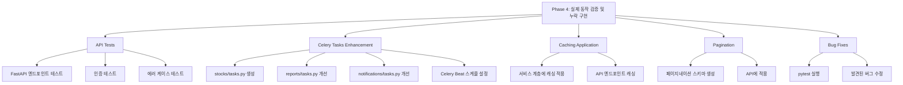

# 사용자의 최초 요청 (기록용)
kstock_project_summary.txt 파일을 읽고 프로젝트 구조 확인
claude_todo_list_2025-11-25 가 포함된 파일을 읽어 작업한 내용을 확인
작업 내용을 분석한 뒤 개선할 점에 대해 확인
개선 내용 작업 진행

## 사용자가 이후에 추가 요청한 내용들 (기록용)
- --review 옵션 포함 (plan-reviewer 에이전트 리뷰 필요)

# 작업 목표
- **Phase 1-3에서 생성된 코드를 실제로 테스트하고 누락된 부분 구현**
- **API 테스트 코드 작성** (httpx 활용, Phase 2에서 누락)
- **Celery 태스크 에러 처리 강화** (Phase 2에서 누락)
- **캐싱 데코레이터 실제 적용** (Phase 2에서 생성만 되고 미적용)
- **API 페이지네이션 개선** (Phase 2 기술 부채)
- **실제 테스트 실행하여 버그 수정**
- **커밋 메시지 규칙에 따라 단계별 커밋**

# 작업 계획 상세 수준
detail_level = detailed

# 작업 배경
Phase 1-3에서 많은 파일(총 64개)을 생성했지만, 다음 문제점들이 발견됨:

1. **API 테스트 부재**: FastAPI 엔드포인트 테스트 코드가 없음 (httpx는 설치했지만 미사용)
2. **Celery 에러 처리 미흡**: tasks.py에 에러 처리가 없어 실패 시 추적 어려움
3. **캐싱 미적용**: apps/common/cache.py 생성했지만 실제 서비스에 적용 안 됨
4. **페이지네이션 부재**: API에서 skip/limit만 사용, 표준 페이지네이션 없음
5. **실제 동작 미검증**: 생성된 코드가 실제로 작동하는지 테스트 필요
6. **커스텀 매니저 미적용**: apps/common/managers.py 생성했지만 models.py에 연결 누락
7. **Celery Beat 스케줄 미설정**: 문서에는 07:00, 07:30, 08:00 실행이라 되어 있으나 실제 설정 안 됨

# 작업 시작 여부
is_execution_started = TRUE

# 모든 목표 달성 여부
is_all_goals_accomplished = FALSE

# 병렬 실행 여부
parallel_requested = FALSE

# 현재 진행 중인 작업
- TODO #0: 작업 시작 전 환경 준비 및 사전 검증

# 필요한 사전 지식

## 기술 스택
- **Python**: 3.11+ (프로젝트 명시, 3.10+ union 문법 사용)
- **Backend**: Django 5.1, FastAPI 0.115
- **Database**: PostgreSQL 16, Redis 7
- **Task Queue**: Celery 5.4 with Beat
- **Testing**: pytest, pytest-django, pytest-asyncio, httpx
- **Code Quality**: black, flake8, mypy

## Redis 데이터베이스 분리
- DB 0: Celery Broker
- DB 1: Celery Results
- DB 2: Django Cache
- DB 3: Rate Limiting

## 프로젝트 구조
```
kstock_reporter/
├── config/          # Django 설정
├── apps/
│   ├── accounts/    # 사용자, 관심목록
│   ├── stocks/      # 주식 종목, 가격 데이터
│   ├── reports/     # 일일 리포트 생성
│   ├── notifications/  # 카카오 알림톡 발송
│   └── common/      # 공통 유틸리티
├── api/             # FastAPI 라우터, 스키마
└── main.py          # FastAPI 애플리케이션
```

## 파일 구조 및 역할

### 1. kstock_reporter/config/settings/base.py
- **역할**: Django 공통 설정 (DB, Celery, Cache)
- **참고할 부분**: CELERY_BEAT_SCHEDULE 섹션 (부분적으로 존재)
- **현재 상태**:
  - ✅ 이미 존재: create_daily_reports_at_0730 (07:30)
  - ✅ 이미 존재: send_daily_reports_at_0800 (08:00)
  - ❌ 누락: sync_stock_master_task (07:00)
  - ❌ 누락: sync_daily_prices_task (07:20)
- **추가 필요한 코드**:
```python
CELERY_BEAT_SCHEDULE = {
    # 새로 추가 필요
    "sync-stock-master-daily": {
        "task": "apps.stocks.tasks.sync_stock_master_task",
        "schedule": crontab(hour=7, minute=0),
        "options": {"expires": 3600},
    },
    "sync-daily-prices-daily": {
        "task": "apps.stocks.tasks.sync_daily_prices_task",
        "schedule": crontab(hour=7, minute=20),
        "options": {"expires": 3600},
    },
    # 아래 두 개는 이미 존재함
    "create_daily_reports_at_0730": {...},  # 이미 존재
    "send_daily_reports_at_0800": {...},     # 이미 존재
}
```

### 2. kstock_reporter/apps/stocks/tasks.py
- **역할**: Celery 태스크로 주식 데이터 수집
- **주의사항**: 파일 자체가 존재하지 않음! 생성 필요
- **필요한 함수**:
```python
@shared_task(bind=True, max_retries=3)
def sync_stock_master_task(self, target_date_str: str | None = None):
    # services.py의 sync_stock_master_from_krx 호출
    # 에러 처리: try-except로 StockDataFetchError 잡고 로깅
    # self.retry(exc=..., countdown=60) 로 재시도
```

### 3. kstock_reporter/apps/reports/tasks.py
- **역할**: 리포트 생성 Celery 태스크
- **참고할 부분**: create_daily_reports_for_all_users 함수
- **현재 문제**: 에러 처리 없음, 로깅 없음
- **개선 필요**: try-except, 로거 추가

### 4. kstock_reporter/apps/notifications/tasks.py
- **역할**: 카카오 알림톡 발송 Celery 태스크
- **참고할 부분**: send_daily_reports_via_kakao 함수
- **현재 문제**: 에러 처리 없음, 로깅 없음, 실패 시 재시도 없음

### 5. kstock_reporter/api/v1/stocks.py
- **역할**: FastAPI 주식 API 엔드포인트
- **참고할 부분**: list_stocks 함수 (skip/limit 사용)
- **개선 필요**: 표준 페이지네이션 응답 (total_count, page, page_size, items)

### 6. kstock_reporter/apps/common/cache.py
- **역할**: Redis 캐싱 유틸리티 (@cache_result 데코레이터)
- **현재 상태**: 생성되었으나 실제 서비스에 미적용
- **적용 대상**:
  - apps/stocks/services.py의 데이터 조회 함수
  - api/v1/stocks.py의 list_stocks

### 7. kstock_reporter/apps/common/managers.py
- **역할**: 커스텀 QuerySet 매니저 (StockQuerySet, DailyPriceQuerySet 등)
- **현재 상태**: 생성되었으나 models.py에 연결 안 됨
- **적용 대상**:
  - apps/stocks/models.py: Stock.objects, DailyPrice.objects
  - apps/accounts/models.py: WatchList.objects
  - apps/reports/models.py: DailyReport.objects

## 맥락 이해를 위해 참고해야 할 파일들

### 1. /Users/indent/Desktop/Noah/repo/kstock_reporter/apps/stocks/services.py
- **역할**: pykrx를 사용해 주식 데이터 수집 (sync_stock_master_from_krx, sync_daily_prices_from_krx)
- **참고할 부분**: @log_execution_time, @retry_on_failure 데코레이터 사용 패턴
- **주의사항**: 이미 에러 처리와 로깅이 잘 되어 있으므로 패턴 참고

### 2. /Users/indent/Desktop/Noah/repo/kstock_reporter/apps/reports/services.py
- **역할**: 리포트 생성 로직 (get_watchlist_top_bottom, build_daily_report_text, create_daily_report_for_user)
- **참고할 부분**: select_related() 사용, 로깅 패턴
- **개선 기회**: @cache_result 데코레이터 적용 가능

### 3. /Users/indent/Desktop/Noah/repo/kstock_reporter/conftest.py
- **역할**: pytest 공통 fixture (user, stock, daily_price 등)
- **참고할 부분**: fixture 작성 패턴
- **확장 필요**: API 테스트용 client fixture 추가

### 4. /Users/indent/Desktop/Noah/repo/kstock_reporter/requirements.txt
- **역할**: Python 패키지 의존성
- **확인 사항**: httpx, pytest-asyncio 설치 여부 (FastAPI 테스트용)

## 프로젝트 커밋 메시지 스타일
```bash
# 최근 커밋 분석 결과:
fe93a06 add .gitignore
ed851c9 Initial commit
```

**커밋 메시지 패턴**:
- 소문자로 시작
- 동사로 시작 (add, fix, update, refactor, test 등)
- 간결한 명령문 (예: "add API test for stocks endpoint")
- 본문이 필요한 경우 빈 줄 후 자세한 설명

# 작업 계획

## PRDs & Structures



```mermaid
flowchart LR
    subgraph "API Testing"
        T1[httpx.AsyncClient] --> T2[FastAPI 테스트]
        T2 --> T3[JWT 인증 테스트]
        T3 --> T4[CRUD 작업 테스트]
    end

    subgraph "Celery Enhancement"
        C1[stocks/tasks.py] --> C2[에러 처리]
        C2 --> C3[재시도 로직]
        C3 --> C4[로깅]
    end

    subgraph "Caching Layer"
        CA1[@cache_result] --> CA2[services.py]
        CA2 --> CA3[Redis DB2]
    end

    subgraph "Custom Managers"
        M1[StockQuerySet] --> M2[Stock.objects]
        M3[DailyPriceQuerySet] --> M4[DailyPrice.objects]
    end
```

## 구현 세부사항

### 1. API 테스트 작성 (httpx 사용)
- **위치**: `api/tests/` 디렉토리 생성
- **파일**: test_auth.py, test_stocks.py, test_watchlists.py, test_reports.py
- **fixture**: httpx.AsyncClient를 사용한 client fixture
- **커버리지**: 모든 CRUD 엔드포인트, 인증 실패 케이스, 404/400 에러

### 2. Celery 태스크 강화
- **apps/stocks/tasks.py 생성**: sync_stock_master_task, sync_daily_prices_task
- **에러 처리**: `@shared_task(bind=True, max_retries=3)` + try-except
- **재시도 로직**: `self.retry(exc=..., countdown=60)`
- **로깅**: logger.info(), logger.error()
- **reports/tasks.py, notifications/tasks.py 개선**: 동일한 패턴 적용

### 3. Celery Beat 스케줄 설정
- **위치**: config/settings/base.py
- **추가**: CELERY_BEAT_SCHEDULE 딕셔너리
- **스케줄**:
  - 07:00: sync_stock_master_task
  - 07:20: sync_daily_prices_task
  - 07:30: create_daily_reports_for_all_users
  - 08:00: send_daily_reports_via_kakao

### 4. 캐싱 실제 적용
- **api/v1/stocks.py**: list_stocks에 캐싱 적용 (15분 TTL, 페이지별 캐시 키 생성)
- **apps/reports/services.py**: get_watchlist_top_bottom에 캐싱 (5분 TTL)
- **주의**: 페이지네이션 적용 시 캐시 키에 page 파라미터 포함 필요

### 5. API 페이지네이션 개선
- **스키마 생성**: api/schemas/pagination.py (PaginatedResponse[T])
- **적용**: api/v1/stocks.py, api/v1/watchlists.py, api/v1/reports.py
- **응답 형식**: `{total: int, page: int, page_size: int, items: List[T]}`

### 6. 커스텀 매니저 적용
- **apps/stocks/models.py**: `Stock.objects = StockQuerySet.as_manager()`
- **apps/accounts/models.py**: `WatchList.objects = WatchListQuerySet.as_manager()`
- **apps/reports/models.py**: `DailyReport.objects = DailyReportQuerySet.as_manager()`
- **마이그레이션**: makemigrations 후 확인

### 7. 실제 테스트 실행 및 버그 수정
- **pytest 실행**: `pytest --cov=apps --cov=api -v`
- **발견된 버그**: import 오류, 타입 오류 등 수정
- **black, flake8, mypy 실행**: 코드 품질 검증

# TODOs

- [ ] 0. 작업 시작 전 환경 준비 및 사전 검증
   - [ ] 0.1 Django settings 환경 변수 확인
      ```bash
      echo $DJANGO_SETTINGS_MODULE
      # 출력이 없거나 잘못되었다면:
      export DJANGO_SETTINGS_MODULE=config.settings.development
      ```
   - [ ] 0.2 Redis 연결 확인
      ```bash
      redis-cli ping
      # PONG 응답 확인
      ```
   - [ ] 0.3 Celery worker 실행 상태 확인
      ```bash
      celery -A config inspect active
      # 또는 백그라운드에서 실행:
      # celery -A config worker -l info &
      ```
   - [ ] 0.4 Celery beat 실행 상태 확인
      ```bash
      # 백그라운드에서 실행:
      # celery -A config beat -l info &
      ```
   - [ ] 0.5 기존 conftest.py 읽고 fixture 충돌 확인
      ```bash
      cat conftest.py
      # user, stock, daily_price fixture가 이미 있는지 확인
      ```
   - [ ] 0.6 apps/common/exceptions.py 읽고 필요한 예외 클래스 존재 확인
      ```bash
      grep "StockDataFetchError\|ReportGenerationError\|KakaoAPIError" apps/common/exceptions.py
      # 3개 예외 클래스 모두 존재하는지 확인
      ```
   - [ ] 0.7 apps/common/cache.py 읽고 @cache_result 데코레이터 동작 방식 확인
      ```bash
      cat apps/common/cache.py
      # make_cache_key 함수가 어떻게 인자를 캐시 키로 변환하는지 확인
      # User 객체 같은 모델 인스턴스 처리 방식 확인
      ```
   - [ ] 0.8 pytest-asyncio 설치 확인
      ```bash
      pip list | grep pytest-asyncio || pip install pytest-asyncio==0.23.2
      ```
   - [ ] 아래의 가이드대로 진행했을 때 0번 작업 검증 성공 여부
      - [ ] DJANGO_SETTINGS_MODULE 환경 변수가 설정되었는가?
      - [ ] redis-cli ping이 PONG을 반환하는가?
      - [ ] conftest.py의 기존 fixture를 확인했는가?
      - [ ] apps/common/exceptions.py에 필요한 3개 예외가 모두 존재하는가?
      - [ ] apps/common/cache.py의 캐시 키 생성 로직을 이해했는가?
      - [ ] pytest-asyncio가 설치되었는가?

- [ ] 1. API 테스트 인프라 구축 및 인증 테스트 작성
   - [ ] 1.1 구현: `api/tests/__init__.py` 생성
   - [ ] 1.2 구현: `api/tests/conftest.py` 생성
      ```python
      import pytest
      import pytest_asyncio
      from httpx import AsyncClient
      from main import app
      from django.contrib.auth import get_user_model
      from apps.accounts.models import User

      @pytest_asyncio.fixture  # async fixture는 pytest_asyncio 사용
      async def client():
          async with AsyncClient(app=app, base_url="http://test") as ac:
              yield ac

      @pytest.fixture
      def test_user(db):
          User = get_user_model()
          return User.objects.create_user(
              username="testuser",
              email="test@example.com",
              password="testpass123",
              phone_number="010-1234-5678"
          )

      @pytest_asyncio.fixture  # async fixture는 pytest_asyncio 사용
      async def authenticated_client(client, test_user):
          # 로그인 후 JWT 토큰 획득
          response = await client.post(
              "/api/v1/auth/login",
              json={"username": "testuser", "password": "testpass123"}
          )
          token = response.json()["access_token"]
          client.headers.update({"Authorization": f"Bearer {token}"})
          return client
      ```
      - 현재: API 테스트 파일 없음
      - 변경: httpx.AsyncClient 기반 fixture 생성 (pytest_asyncio.fixture 사용)
   - [ ] 1.3 구현: `api/tests/test_auth.py` 생성
      ```python
      import pytest
      from httpx import AsyncClient

      @pytest.mark.asyncio
      async def test_register_success(client: AsyncClient):
          response = await client.post(
              "/api/v1/auth/register",
              json={
                  "username": "newuser",
                  "email": "new@example.com",
                  "password": "newpass123",
                  "phone_number": "010-9999-9999"
              }
          )
          assert response.status_code == 200
          data = response.json()
          assert data["username"] == "newuser"
          assert "password" not in data

      @pytest.mark.asyncio
      async def test_register_duplicate_username(client: AsyncClient, test_user):
          response = await client.post(
              "/api/v1/auth/register",
              json={
                  "username": "testuser",  # 이미 존재
                  "email": "another@example.com",
                  "password": "pass123"
              }
          )
          assert response.status_code == 400
          assert "already exists" in response.json()["detail"]

      @pytest.mark.asyncio
      async def test_login_success(client: AsyncClient, test_user):
          response = await client.post(
              "/api/v1/auth/login",
              json={"username": "testuser", "password": "testpass123"}
          )
          assert response.status_code == 200
          data = response.json()
          assert "access_token" in data
          assert data["token_type"] == "bearer"

      @pytest.mark.asyncio
      async def test_login_invalid_credentials(client: AsyncClient, test_user):
          response = await client.post(
              "/api/v1/auth/login",
              json={"username": "testuser", "password": "wrongpass"}
          )
          assert response.status_code == 401
      ```
      - 현재: 인증 테스트 없음
      - 변경: 회원가입, 로그인, 실패 케이스 테스트 추가
   - [ ] 1.4 테스트 실행: `pytest -xvs api/tests/test_auth.py`
   - [ ] 1.5 린트 및 타입 체크
      - [ ] `ruff check api/tests/`
      - [ ] `basedpyright api/tests/`
   - [ ] 1.6 테스트 통과 확인 후 커밋
      - 커밋 메시지: `add API authentication tests with httpx`
   - [ ] 아래의 가이드대로 진행했을 때 1번 작업 검증 성공 여부
      - [ ] api/tests/ 디렉토리가 생성되었는가?
      - [ ] conftest.py에 client, test_user, authenticated_client fixture가 있는가?
      - [ ] test_auth.py에 최소 4개의 테스트 함수가 있는가?
      - [ ] pytest 실행 시 모든 인증 테스트가 통과하는가?
      - [ ] 린트/타입 체크가 통과하는가?
      - [ ] git log에 커밋이 추가되었는가?

- [ ] 2. 주식 API 테스트 작성 (CRUD 및 가격 조회)
   - [ ] 2.1 구현: `api/tests/test_stocks.py` 생성
      ```python
      import pytest
      from httpx import AsyncClient
      from apps.stocks.models import Stock, DailyPrice
      from datetime import date

      @pytest.mark.asyncio
      async def test_list_stocks(authenticated_client: AsyncClient, stock):
          response = await authenticated_client.get("/api/v1/stocks/")
          assert response.status_code == 200
          data = response.json()
          assert isinstance(data, list)
          assert len(data) > 0

      @pytest.mark.asyncio
      async def test_list_stocks_with_search(authenticated_client: AsyncClient, stock):
          response = await authenticated_client.get(
              "/api/v1/stocks/",
              params={"search": stock.name[:2]}
          )
          assert response.status_code == 200
          data = response.json()
          assert len(data) > 0

      @pytest.mark.asyncio
      async def test_get_stock_detail(authenticated_client: AsyncClient, stock):
          response = await authenticated_client.get(f"/api/v1/stocks/{stock.code}")
          assert response.status_code == 200
          data = response.json()
          assert data["code"] == stock.code
          assert data["name"] == stock.name

      @pytest.mark.asyncio
      async def test_get_stock_not_found(authenticated_client: AsyncClient):
          response = await authenticated_client.get("/api/v1/stocks/999999")
          assert response.status_code == 404

      @pytest.mark.asyncio
      async def test_get_stock_prices(authenticated_client: AsyncClient, stock, daily_price):
          response = await authenticated_client.get(f"/api/v1/stocks/{stock.code}/prices")
          assert response.status_code == 200
          data = response.json()
          assert isinstance(data, list)

      @pytest.mark.asyncio
      async def test_list_stocks_unauthenticated(client: AsyncClient):
          response = await client.get("/api/v1/stocks/")
          assert response.status_code == 401
      ```
      - 현재: 주식 API 테스트 없음
      - 변경: 목록, 검색, 상세, 가격 조회, 인증 실패 테스트 추가
   - [ ] 2.2 테스트 실행: `pytest -xvs api/tests/test_stocks.py`
   - [ ] 2.3 린트 및 타입 체크
      - [ ] `ruff check api/tests/test_stocks.py`
      - [ ] `basedpyright api/tests/test_stocks.py`
   - [ ] 2.4 테스트 통과 확인 후 커밋
      - 커밋 메시지: `add stocks API CRUD and price tests`
   - [ ] 아래의 가이드대로 진행했을 때 2번 작업 검증 성공 여부
      - [ ] test_stocks.py에 최소 6개의 테스트 함수가 있는가?
      - [ ] 모든 CRUD 작업 (list, get, search, prices)이 테스트되는가?
      - [ ] 인증 실패 케이스 (401)가 테스트되는가?
      - [ ] Not Found 케이스 (404)가 테스트되는가?
      - [ ] pytest 실행 시 모든 테스트가 통과하는가?
      - [ ] 커밋이 완료되었는가?

- [ ] 3. Celery 태스크 생성 및 에러 처리 강화 (stocks 앱)
   - [ ] 3.1 구현: `apps/stocks/tasks.py` 생성
      ```python
      import logging
      from datetime import date
      from celery import shared_task

      from .services import sync_stock_master_from_krx, sync_daily_prices_from_krx
      from apps.common.exceptions import StockDataFetchError

      logger = logging.getLogger(__name__)

      @shared_task(bind=True, max_retries=3, default_retry_delay=60)
      def sync_stock_master_task(self, target_date_str: str | None = None):
          """
          주식 종목 마스터 데이터 동기화 태스크
          """
          try:
              if target_date_str:
                  target_date = date.fromisoformat(target_date_str)
              else:
                  target_date = date.today()

              logger.info(f"[Task] Starting stock master sync for {target_date}")
              count = sync_stock_master_from_krx(target_date)
              logger.info(f"[Task] Completed stock master sync: {count} stocks")
              return {"success": True, "count": count, "date": target_date_str}

          except StockDataFetchError as exc:
              logger.error(f"[Task] Stock master sync failed: {exc}", exc_info=True)
              raise self.retry(exc=exc, countdown=60)
          except Exception as exc:
              logger.error(f"[Task] Unexpected error in stock master sync: {exc}", exc_info=True)
              raise self.retry(exc=exc, countdown=60)

      @shared_task(bind=True, max_retries=3, default_retry_delay=60)
      def sync_daily_prices_task(self, target_date_str: str | None = None):
          """
          일별 주가 데이터 동기화 태스크
          """
          try:
              if target_date_str:
                  target_date = date.fromisoformat(target_date_str)
              else:
                  target_date = date.today()

              logger.info(f"[Task] Starting daily price sync for {target_date}")
              count = sync_daily_prices_from_krx(target_date)
              logger.info(f"[Task] Completed daily price sync: {count} prices")
              return {"success": True, "count": count, "date": target_date_str}

          except StockDataFetchError as exc:
              logger.error(f"[Task] Daily price sync failed: {exc}", exc_info=True)
              raise self.retry(exc=exc, countdown=60)
          except Exception as exc:
              logger.error(f"[Task] Unexpected error in daily price sync: {exc}", exc_info=True)
              raise self.retry(exc=exc, countdown=60)
      ```
      - 현재: apps/stocks/tasks.py 파일 없음
      - 변경: Celery 태스크 생성, bind=True, max_retries, 로깅, self.retry
   - [ ] 3.2 테스트 작성: `apps/stocks/tests/test_tasks.py` 생성
      ```python
      import pytest
      from unittest.mock import patch, MagicMock
      from datetime import date
      from celery.exceptions import Retry
      from apps.stocks.tasks import sync_stock_master_task, sync_daily_prices_task
      from apps.common.exceptions import StockDataFetchError

      @pytest.mark.django_db
      def test_sync_stock_master_task_success():
          with patch('apps.stocks.tasks.sync_stock_master_from_krx') as mock_sync:
              mock_sync.return_value = 100
              result = sync_stock_master_task()
              assert result["success"] is True
              assert result["count"] == 100

      @pytest.mark.django_db
      def test_sync_stock_master_task_retry_on_failure():
          with patch('apps.stocks.tasks.sync_stock_master_from_krx') as mock_sync:
              mock_sync.side_effect = StockDataFetchError("API error")
              task = sync_stock_master_task
              task.retry = MagicMock(side_effect=Retry("Retry called"))

              with pytest.raises(Retry):
                  task()

      @pytest.mark.django_db
      def test_sync_stock_master_task_exhausted_retries():
          """재시도 3회 모두 실패 후 최종 예외 발생 테스트"""
          with patch('apps.stocks.tasks.sync_stock_master_from_krx') as mock_sync:
              mock_sync.side_effect = StockDataFetchError("Persistent API error")
              task = sync_stock_master_task
              # max_retries를 초과하면 원래 예외가 발생
              task.max_retries = 0  # 재시도 없이 바로 실패

              with pytest.raises(StockDataFetchError):
                  task()

      @pytest.mark.django_db
      def test_sync_daily_prices_task_success():
          with patch('apps.stocks.tasks.sync_daily_prices_from_krx') as mock_sync:
              mock_sync.return_value = 500
              result = sync_daily_prices_task()
              assert result["success"] is True
              assert result["count"] == 500
      ```
      - 현재: stocks 태스크 테스트 없음
      - 변경: 성공/실패/재시도/재시도 소진 케이스 테스트
   - [ ] 3.3 테스트 실행: `pytest -xvs apps/stocks/tests/test_tasks.py`
   - [ ] 3.4 린트 및 타입 체크
      - [ ] `ruff check apps/stocks/tasks.py`
      - [ ] `basedpyright apps/stocks/tasks.py`
   - [ ] 3.5 테스트 통과 확인 후 커밋
      - 커밋 메시지: `add Celery tasks for stock data sync with error handling`
   - [ ] 아래의 가이드대로 진행했을 때 3번 작업 검증 성공 여부
      - [ ] apps/stocks/tasks.py 파일이 생성되었는가?
      - [ ] sync_stock_master_task, sync_daily_prices_task 함수가 있는가?
      - [ ] @shared_task(bind=True, max_retries=3) 데코레이터가 적용되었는가?
      - [ ] try-except로 StockDataFetchError를 잡고 self.retry() 하는가?
      - [ ] logger.info(), logger.error() 로깅이 있는가?
      - [ ] 테스트 파일에 최소 2개의 테스트 함수가 있는가?
      - [ ] pytest 실행 시 통과하는가?
      - [ ] 커밋이 완료되었는가?

- [ ] 4. Celery 태스크 에러 처리 개선 (reports, notifications 앱)
   - [ ] 4.1 구현: `apps/reports/tasks.py` 개선
      ```python
      import logging
      from datetime import date
      from celery import shared_task
      from django.contrib.auth import get_user_model

      from .services import create_daily_report_for_user
      from apps.common.exceptions import ReportGenerationError

      User = get_user_model()
      logger = logging.getLogger(__name__)

      @shared_task(bind=True, max_retries=2, default_retry_delay=300)
      def create_daily_reports_for_all_users(self, target_date_str: str | None = None):
          """
          모든 사용자 일일 리포트 생성 태스크
          """
          try:
              if target_date_str:
                  target_date = date.fromisoformat(target_date_str)
              else:
                  target_date = date.today()

              logger.info(f"[Task] Starting daily reports generation for {target_date}")

              users = User.objects.filter(receive_daily_report=True)
              success_count = 0
              fail_count = 0

              for user in users:
                  try:
                      create_daily_report_for_user(user, target_date)
                      success_count += 1
                  except ReportGenerationError as e:
                      logger.error(f"[Task] Failed to create report for user {user.id}: {e}")
                      fail_count += 1
                  except Exception as e:
                      logger.error(f"[Task] Unexpected error for user {user.id}: {e}", exc_info=True)
                      fail_count += 1

              logger.info(f"[Task] Completed daily reports: {success_count} success, {fail_count} failed")
              return {"success": True, "success_count": success_count, "fail_count": fail_count}

          except Exception as exc:
              logger.error(f"[Task] Daily reports task failed: {exc}", exc_info=True)
              raise self.retry(exc=exc, countdown=300)
      ```
      - 현재: 에러 처리 없음, 로깅 없음
      - 변경: bind=True, 사용자별 try-except, 성공/실패 카운트, 로깅
   - [ ] 4.2 구현: `apps/notifications/tasks.py` 개선
      ```python
      import logging
      from datetime import date
      from celery import shared_task
      from django.contrib.auth import get_user_model

      from apps.reports.models import DailyReport
      from .models import NotificationLog
      from .services.kakao_client import KakaoAlimtalkClient
      from apps.common.exceptions import KakaoAPIError

      User = get_user_model()
      logger = logging.getLogger(__name__)

      @shared_task(bind=True, max_retries=2, default_retry_delay=300)
      def send_daily_reports_via_kakao(self, target_date_str: str | None = None, template_code: str = "DAILY_STOCK_REPORT"):
          """
          카카오 알림톡 발송 태스크
          """
          try:
              if target_date_str:
                  target_date = date.fromisoformat(target_date_str)
              else:
                  target_date = date.today()

              logger.info(f"[Task] Starting Kakao notification for {target_date}")

              client = KakaoAlimtalkClient()
              users = User.objects.filter(receive_daily_report=True)
              success_count = 0
              fail_count = 0

              for user in users:
                  if not user.phone_number:
                      logger.warning(f"[Task] User {user.id} has no phone number, skipping")
                      continue

                  try:
                      report = DailyReport.objects.get(user=user, report_date=target_date)
                  except DailyReport.DoesNotExist:
                      logger.warning(f"[Task] No report found for user {user.id} on {target_date}")
                      continue

                  try:
                      result = client.send_message(
                          to_phone=user.phone_number,
                          template_code=template_code,
                          message=report.body_text,
                      )

                      success = (200 <= result["status_code"] < 300)
                      NotificationLog.objects.create(
                          user=user,
                          channel=NotificationLog.CHANNEL_KAKAO,
                          message=report.body_text,
                          success=success,
                          response_code=str(result["status_code"]),
                          response_body=result["body"],
                      )

                      if success:
                          success_count += 1
                          logger.info(f"[Task] Kakao sent to user {user.id}")
                      else:
                          fail_count += 1
                          logger.error(f"[Task] Kakao failed for user {user.id}: {result}")

                  except KakaoAPIError as e:
                      logger.error(f"[Task] Kakao API error for user {user.id}: {e}")
                      fail_count += 1
                  except Exception as e:
                      logger.error(f"[Task] Unexpected error for user {user.id}: {e}", exc_info=True)
                      fail_count += 1

              logger.info(f"[Task] Completed Kakao notifications: {success_count} success, {fail_count} failed")
              return {"success": True, "success_count": success_count, "fail_count": fail_count}

          except Exception as exc:
              logger.error(f"[Task] Kakao notification task failed: {exc}", exc_info=True)
              raise self.retry(exc=exc, countdown=300)
      ```
      - 현재: 에러 처리 없음, 로깅 없음
      - 변경: bind=True, 사용자별 try-except, 성공/실패 카운트, 로깅
   - [ ] 4.3 테스트 실행: `pytest -xvs apps/reports/tests/ apps/notifications/tests/`
   - [ ] 4.4 린트 및 타입 체크
      - [ ] `ruff check apps/reports/tasks.py apps/notifications/tasks.py`
      - [ ] `basedpyright apps/reports/tasks.py apps/notifications/tasks.py`
   - [ ] 4.5 테스트 통과 확인 후 커밋
      - 커밋 메시지: `improve error handling in reports and notifications tasks`
   - [ ] 아래의 가이드대로 진행했을 때 4번 작업 검증 성공 여부
      - [ ] reports/tasks.py에 @shared_task(bind=True, max_retries=2)가 적용되었는가?
      - [ ] notifications/tasks.py에 @shared_task(bind=True, max_retries=2)가 적용되었는가?
      - [ ] 사용자별 for loop 안에 try-except가 있는가?
      - [ ] success_count, fail_count를 추적하는가?
      - [ ] logger.info(), logger.warning(), logger.error() 로깅이 충분한가?
      - [ ] pytest 실행 시 기존 테스트가 통과하는가?
      - [ ] 커밋이 완료되었는가?

- [ ] 5. Celery Beat 스케줄 설정 (2개 태스크 추가)
   - [ ] 5.1 구현: `config/settings/base.py`의 CELERY_BEAT_SCHEDULE에 추가
      ```python
      # CELERY_BEAT_SCHEDULE 딕셔너리에 아래 2개 항목 추가
      # (이미 존재하는 create_daily_reports_at_0730, send_daily_reports_at_0800는 유지)

      CELERY_BEAT_SCHEDULE = {
          # ===== 새로 추가할 항목 =====
          "sync-stock-master-daily": {
              "task": "apps.stocks.tasks.sync_stock_master_task",
              "schedule": crontab(hour=7, minute=0),
              "options": {"expires": 3600},
          },
          "sync-daily-prices-daily": {
              "task": "apps.stocks.tasks.sync_daily_prices_task",
              "schedule": crontab(hour=7, minute=20),
              "options": {"expires": 3600},
          },
          # ===== 아래는 이미 존재하는 항목 (수정 불필요) =====
          "create_daily_reports_at_0730": {
              "task": "apps.reports.tasks.create_daily_reports_for_all_users",
              "schedule": crontab(hour=7, minute=30),
          },
          "send_daily_reports_at_0800": {
              "task": "apps.notifications.tasks.send_daily_reports_via_kakao",
              "schedule": crontab(hour=8, minute=0),
          },
      }
      ```
      - 현재: CELERY_BEAT_SCHEDULE에 2개 항목만 존재 (07:30, 08:00)
      - 변경: 2개 항목 추가 (07:00, 07:20)
   - [ ] 5.2 확인: `config/settings/base.py` 읽기
   - [ ] 5.3 린트 및 타입 체크
      - [ ] `ruff check config/settings/base.py`
      - [ ] `basedpyright config/settings/base.py`
   - [ ] 5.4 문서 업데이트: `README.md`에 Celery Beat 스케줄 섹션 추가
   - [ ] 5.5 커밋
      - 커밋 메시지: `add stock sync tasks to Celery Beat schedule`
   - [ ] 아래의 가이드대로 진행했을 때 5번 작업 검증 성공 여부
      - [ ] config/settings/base.py의 CELERY_BEAT_SCHEDULE에 총 4개 항목이 있는가?
      - [ ] sync-stock-master-daily, sync-daily-prices-daily 2개가 새로 추가되었는가?
      - [ ] 기존 create_daily_reports_at_0730, send_daily_reports_at_0800는 그대로 유지되는가?
      - [ ] crontab(hour=7, minute=0), crontab(hour=7, minute=20)이 정확한가?
      - [ ] "expires": 3600 옵션이 새 항목에 추가되었는가?
      - [ ] README.md에 전체 스케줄 (07:00, 07:20, 07:30, 08:00)이 업데이트되었는가?
      - [ ] 커밋이 완료되었는가?

- [ ] 6. 커스텀 매니저를 모델에 연결
   - [ ] 6.1 구현: `apps/stocks/models.py` 수정
      ```python
      from apps.common.managers import StockQuerySet, DailyPriceQuerySet

      class Stock(models.Model):
          # ... 기존 필드들 ...

          objects = StockQuerySet.as_manager()  # 추가

          class Meta:
              # ... 기존 메타 ...

      class DailyPrice(models.Model):
          # ... 기존 필드들 ...

          objects = DailyPriceQuerySet.as_manager()  # 추가

          class Meta:
              # ... 기존 메타 ...
      ```
      - 현재: Stock.objects = models.Manager() (기본)
      - 변경: Stock.objects = StockQuerySet.as_manager()
   - [ ] 6.2 구현: `apps/accounts/models.py` 수정
      ```python
      from apps.common.managers import WatchListQuerySet

      class WatchList(models.Model):
          # ... 기존 필드들 ...

          objects = WatchListQuerySet.as_manager()  # 추가
      ```
      - 현재: WatchList.objects = models.Manager() (기본)
      - 변경: WatchList.objects = WatchListQuerySet.as_manager()
   - [ ] 6.3 구현: `apps/reports/models.py` 수정
      ```python
      from apps.common.managers import DailyReportQuerySet

      class DailyReport(models.Model):
          # ... 기존 필드들 ...

          objects = DailyReportQuerySet.as_manager()  # 추가
      ```
      - 현재: DailyReport.objects = models.Manager() (기본)
      - 변경: DailyReport.objects = DailyReportQuerySet.as_manager()
   - [ ] 6.4 테스트: 커스텀 매니저 메서드 사용 확인
      ```python
      # Django shell에서 테스트
      from apps.stocks.models import Stock, DailyPrice

      # StockQuerySet 메서드 테스트
      active_stocks = Stock.objects.active()
      kospi_stocks = Stock.objects.by_market('KOSPI')
      search_results = Stock.objects.search('삼성')

      # DailyPriceQuerySet 메서드 테스트
      top_gainers = DailyPrice.objects.top_gainers(limit=10)
      ```
   - [ ] 6.5 린트 및 타입 체크
      - [ ] `ruff check apps/stocks/models.py apps/accounts/models.py apps/reports/models.py`
      - [ ] `basedpyright apps/stocks/models.py apps/accounts/models.py apps/reports/models.py`
   - [ ] 6.6 커밋
      - 커밋 메시지: `apply custom QuerySet managers to models`
   - [ ] 아래의 가이드대로 진행했을 때 6번 작업 검증 성공 여부
      - [ ] apps/stocks/models.py에 `from apps.common.managers import ...` 임포트가 있는가?
      - [ ] Stock 모델에 `objects = StockQuerySet.as_manager()`가 있는가?
      - [ ] DailyPrice 모델에 `objects = DailyPriceQuerySet.as_manager()`가 있는가?
      - [ ] apps/accounts/models.py의 WatchList에 매니저가 적용되었는가?
      - [ ] apps/reports/models.py의 DailyReport에 매니저가 적용되었는가?
      - [ ] Django shell에서 Stock.objects.active() 같은 커스텀 메서드가 작동하는가?
      - [ ] 커밋이 완료되었는가?

- [ ] 7. API 페이지네이션 스키마 생성 및 적용
   - [ ] 7.1 구현: `api/schemas/pagination.py` 생성
      ```python
      from typing import Generic, TypeVar, List
      from pydantic import BaseModel

      T = TypeVar('T')

      class PaginatedResponse(BaseModel, Generic[T]):
          """
          페이지네이션 응답 스키마
          """
          total: int
          page: int
          page_size: int
          total_pages: int
          items: List[T]

          @classmethod
          def create(cls, items: List[T], total: int, page: int, page_size: int):
              """
              페이지네이션 응답 생성 헬퍼 메서드
              """
              total_pages = (total + page_size - 1) // page_size
              return cls(
                  total=total,
                  page=page,
                  page_size=page_size,
                  total_pages=total_pages,
                  items=items
              )
      ```
      - 현재: 페이지네이션 스키마 없음
      - 변경: Generic 타입 사용한 재사용 가능한 스키마
   - [ ] 7.2 구현: `api/v1/stocks.py` 수정 (페이지네이션 적용)
      ```python
      from api.schemas.pagination import PaginatedResponse

      @router.get("/", response_model=PaginatedResponse[StockResponse])
      async def list_stocks(
          page: int = Query(default=1, ge=1),
          page_size: int = Query(default=20, ge=1, le=100),
          market: Optional[str] = None,
          search: Optional[str] = None,
          current_user: User = Depends(get_current_user),
      ):
          """
          주식 목록 조회 (페이지네이션)
          """
          queryset = Stock.objects.filter(is_active=True)

          if market:
              queryset = queryset.filter(market=market)

          if search:
              queryset = queryset.filter(name__icontains=search) | queryset.filter(
                  code__icontains=search
              )

          total = queryset.count()
          offset = (page - 1) * page_size
          stocks = queryset[offset : offset + page_size]

          items = [StockResponse.model_validate(stock) for stock in stocks]
          return PaginatedResponse.create(
              items=items,
              total=total,
              page=page,
              page_size=page_size
          )
      ```
      - 현재: skip/limit 사용
      - 변경: page/page_size + total_count 포함
   - [ ] 7.3 구현: `api/v1/reports.py` 수정 (페이지네이션 적용)
      - 동일한 패턴으로 list_reports 함수 수정
   - [ ] 7.4 테스트: `api/tests/test_pagination.py` 생성
      ```python
      import pytest
      from httpx import AsyncClient

      @pytest.mark.asyncio
      async def test_stocks_pagination(authenticated_client: AsyncClient, stock):
          response = await authenticated_client.get(
              "/api/v1/stocks/",
              params={"page": 1, "page_size": 10}
          )
          assert response.status_code == 200
          data = response.json()
          assert "total" in data
          assert "page" in data
          assert "page_size" in data
          assert "total_pages" in data
          assert "items" in data
          assert data["page"] == 1
          assert data["page_size"] == 10

      @pytest.mark.asyncio
      async def test_stocks_pagination_page_2(authenticated_client: AsyncClient):
          response = await authenticated_client.get(
              "/api/v1/stocks/",
              params={"page": 2, "page_size": 5}
          )
          assert response.status_code == 200
          data = response.json()
          assert data["page"] == 2
      ```
   - [ ] 7.5 테스트 실행: `pytest -xvs api/tests/test_pagination.py`
   - [ ] 7.6 린트 및 타입 체크
      - [ ] `ruff check api/schemas/pagination.py api/v1/stocks.py`
      - [ ] `basedpyright api/schemas/pagination.py api/v1/stocks.py`
   - [ ] 7.7 커밋
      - 커밋 메시지: `add pagination schema and apply to stocks API`
   - [ ] 아래의 가이드대로 진행했을 때 7번 작업 검증 성공 여부
      - [ ] api/schemas/pagination.py 파일이 생성되었는가?
      - [ ] PaginatedResponse[T] Generic 클래스가 있는가?
      - [ ] total, page, page_size, total_pages, items 필드가 있는가?
      - [ ] api/v1/stocks.py의 list_stocks가 PaginatedResponse를 반환하는가?
      - [ ] page, page_size Query 파라미터를 받는가?
      - [ ] test_pagination.py에 최소 2개의 테스트 함수가 있는가?
      - [ ] pytest 실행 시 모든 페이지네이션 테스트가 통과하는가?
      - [ ] 커밋이 완료되었는가?

- [ ] 8. 캐싱 데코레이터를 서비스 및 API에 적용
   - [ ] 8.1 구현: `api/v1/stocks.py`에 캐싱 적용
      ```python
      from apps.common.cache import cache_result

      # 주의: @cache_result는 함수 인자를 기반으로 캐시 키를 생성하므로
      # page 파라미터가 포함되면 페이지별로 캐시가 생성됨 (의도된 동작)
      @cache_result(timeout=900, key_prefix="api_stocks_list")  # 15분
      def _get_cached_stocks_list(market: str | None, search: str | None, page: int, page_size: int):
          """
          주식 목록 조회 (캐시 적용)
          - 캐시 키: api_stocks_list:{market}:{search}:{page}:{page_size}
          - 각 페이지마다 별도 캐시 생성 (정상 동작)
          """
          queryset = Stock.objects.filter(is_active=True)
          if market:
              queryset = queryset.filter(market=market)
          if search:
              queryset = queryset.filter(name__icontains=search) | queryset.filter(code__icontains=search)

          total = queryset.count()
          offset = (page - 1) * page_size
          stocks = list(queryset[offset : offset + page_size])
          return stocks, total

      @router.get("/", response_model=PaginatedResponse[StockResponse])
      async def list_stocks(
          page: int = Query(default=1, ge=1),
          page_size: int = Query(default=20, ge=1, le=100),
          market: Optional[str] = None,
          search: Optional[str] = None,
          current_user: User = Depends(get_current_user),
      ):
          stocks, total = _get_cached_stocks_list(market, search, page, page_size)
          items = [StockResponse.model_validate(stock) for stock in stocks]
          return PaginatedResponse.create(items=items, total=total, page=page, page_size=page_size)
      ```
      - 현재: 캐싱 없음
      - 변경: @cache_result 데코레이터 적용 (15분 TTL)
   - [ ] 8.2 구현: `apps/reports/services.py`에 캐싱 적용
      ```python
      from apps.common.cache import cache_result

      @cache_result(timeout=300, key_prefix="watchlist_top_bottom")  # 5분
      def get_watchlist_top_bottom(user, target_date: date) -> dict:
          # 기존 로직 유지
          ...
      ```
      - 현재: 캐싱 없음
      - 변경: @cache_result 데코레이터 적용 (5분 TTL)
   - [ ] 8.3 테스트: 캐싱 동작 확인
      ```python
      # Django shell 또는 pytest에서
      from apps.reports.services import get_watchlist_top_bottom
      from django.contrib.auth import get_user_model
      from datetime import date

      User = get_user_model()
      user = User.objects.first()

      # 첫 번째 호출 (캐시 미스)
      result1 = get_watchlist_top_bottom(user, date.today())

      # 두 번째 호출 (캐시 히트 - 로그 확인)
      result2 = get_watchlist_top_bottom(user, date.today())
      ```
   - [ ] 8.4 린트 및 타입 체크
      - [ ] `ruff check api/v1/stocks.py apps/reports/services.py`
      - [ ] `basedpyright api/v1/stocks.py apps/reports/services.py`
   - [ ] 8.5 커밋
      - 커밋 메시지: `apply caching decorator to stocks API and report service`
   - [ ] 아래의 가이드대로 진행했을 때 8번 작업 검증 성공 여부
      - [ ] api/v1/stocks.py에 `from apps.common.cache import cache_result` 임포트가 있는가?
      - [ ] _get_cached_stocks_list 함수에 @cache_result(timeout=900) 데코레이터가 있는가?
      - [ ] apps/reports/services.py의 get_watchlist_top_bottom에 @cache_result(timeout=300)가 있는가?
      - [ ] Django shell에서 함수를 두 번 호출했을 때 로그에 "Cache hit" 메시지가 나타나는가?
      - [ ] pytest 실행 시 기존 테스트가 통과하는가?
      - [ ] 커밋이 완료되었는가?

- [ ] 9. 전체 테스트 실행 및 버그 수정
   - [ ] 9.1 전체 테스트 실행
      ```bash
      pytest --cov=apps --cov=api --cov-report=html --cov-report=term -v
      ```
   - [ ] 9.2 발견된 Import 에러 수정
      - [ ] 순환 임포트 해결
      - [ ] 누락된 임포트 추가
   - [ ] 9.3 발견된 타입 에러 수정
      - [ ] mypy 또는 basedpyright 실행
      - [ ] 타입 힌트 추가/수정
   - [ ] 9.4 발견된 로직 에러 수정
      - [ ] 테스트 실패 케이스 분석
      - [ ] 버그 수정
   - [ ] 9.5 코드 품질 체크
      ```bash
      black .
      ruff check .
      basedpyright apps/ api/
      ```
   - [ ] 9.6 모든 수정 사항 커밋
      - 커밋 메시지: `fix bugs found during testing`
   - [ ] 아래의 가이드대로 진행했을 때 9번 작업 검증 성공 여부
      - [ ] pytest 실행 시 모든 테스트가 통과하는가?
      - [ ] 테스트 커버리지가 80% 이상인가?
      - [ ] black . 실행 시 변경 사항이 없는가?
      - [ ] ruff check . 실행 시 에러가 없는가?
      - [ ] basedpyright 실행 시 치명적인 타입 에러가 없는가?
      - [ ] 모든 import 문이 정상적으로 작동하는가?
      - [ ] 버그 수정 커밋이 완료되었는가?

- [ ] 10. requirements.txt 업데이트 및 문서화
   - [ ] 10.1 확인: requirements.txt에 pytest-asyncio 추가 필요 여부 체크
      ```bash
      grep "pytest-asyncio" requirements.txt || echo "pytest-asyncio==0.23.2" >> requirements.txt
      ```
   - [ ] 10.2 문서 업데이트: `README.md`의 "API 사용법" 섹션에 페이지네이션 예시 추가
      ```markdown
      ## API 페이지네이션

      모든 목록 API는 페이지네이션을 지원합니다:

      \```bash
      curl -X GET "http://localhost:8001/api/v1/stocks/?page=1&page_size=20" \
        -H "Authorization: Bearer $TOKEN"
      \```

      응답 형식:
      \```json
      {
        "total": 100,
        "page": 1,
        "page_size": 20,
        "total_pages": 5,
        "items": [...]
      }
      \```
      ```
   - [ ] 10.3 문서 업데이트: `docs/ARCHITECTURE.md`에 Celery Beat 스케줄 추가
   - [ ] 10.4 문서 업데이트: Phase 4 작업 로그 파일 생성
      - `claude_todo_list_2025-11-25_phase4.txt` 생성
      - Phase 4에서 수행한 작업 상세 기록
   - [ ] 10.5 커밋
      - 커밋 메시지: `update documentation for Phase 4 improvements`
   - [ ] 아래의 가이드대로 진행했을 때 10번 작업 검증 성공 여부
      - [ ] requirements.txt에 pytest-asyncio가 있는가?
      - [ ] README.md에 페이지네이션 예시가 추가되었는가?
      - [ ] docs/ARCHITECTURE.md에 Celery Beat 스케줄이 문서화되었는가?
      - [ ] claude_todo_list_2025-11-25_phase4.txt 파일이 생성되었는가?
      - [ ] Phase 4 로그 파일에 작업 내용이 상세히 기록되었는가?
      - [ ] 커밋이 완료되었는가?

# 최종 작업 검증 체크리스트
- [ ] 1. API 테스트가 작성되고 통과하는가? (pytest api/tests/)
- [ ] 2. Celery 태스크에 에러 처리와 로깅이 추가되었는가?
- [ ] 3. Celery Beat 스케줄이 설정되었는가? (config/settings/base.py)
- [ ] 4. 커스텀 매니저가 모델에 적용되었는가? (Stock.objects.active() 작동)
- [ ] 5. API 페이지네이션이 구현되었는가? (total, page, page_size 포함)
- [ ] 6. 캐싱 데코레이터가 실제로 적용되었는가? (Redis에서 캐시 키 확인)
- [ ] 7. 전체 테스트가 통과하는가? (pytest --cov=apps --cov=api)
- [ ] 8. 코드 품질 체크가 통과하는가? (black, ruff, basedpyright)
- [ ] 9. 각 작업 단위별로 커밋이 완료되었는가? (git log 확인)
- [ ] 10. 문서가 업데이트되었는가? (README.md, ARCHITECTURE.md, Phase 4 로그)
- [ ] 11. Phase 1-3에서 생성만 하고 적용 안 한 기능들이 모두 적용되었는가?
- [ ] 12. apps/stocks/tasks.py 파일이 새로 생성되었는가?
